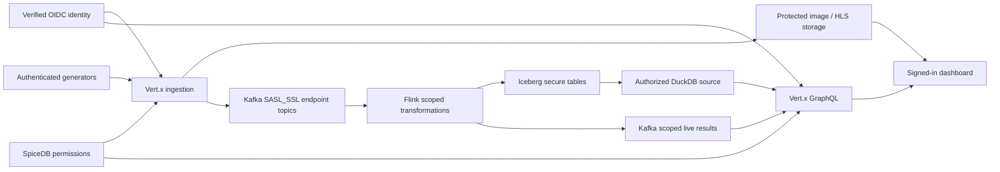

The lakehouse now uses private Polaris + RustFS object storage, with SpiceDB-governed federated GraphQL queries. See [lakehouse architecture, permissions and operations](docs/lakehouse.md).

# Authorized context graph

[Architecture diagram — interactive](docs/diagrams/context-graph-architecture.html) · [SVG](docs/diagrams/context-graph-architecture.svg) · [PNG](docs/diagrams/context-graph-architecture.png) · [PDF](docs/diagrams/context-graph-architecture.pdf)

A configurable streaming system: **Vert.x → Kafka → Flink → Iceberg**, with **DuckDB / GraphQL subscriptions** and a separate metrics/video dashboard. JSON retains arbitrary payload fields; images and keyframe-aligned video chunks live in private local RustFS object storage. Polaris vends warehouse credentials to trusted services; users access data through the SpiceDB-governed serving API. Mandatory verified OIDC identity and SpiceDB permissions protect ingestion, queries, subscriptions, and media.

The implementation uses Java 21, Vert.x 5.2.0, Flink 2.3.0, Kafka 4.1.1, Iceberg 1.11.0, and DuckDB JDBC 1.5.5.1 with `iceberg` and `cache_httpfs`. Compatibility tests exercise the older-targeted Kafka/Iceberg connectors on Flink 2.3; this is application-specific evidence, not upstream certification.



## Authorization model

Workspace membership permits viewing unrestricted workspace entities. Restricted entities require an explicit reader/writer grant, or workspace administrator permission. Ingestion always requires an explicit writer grant or workspace administration. The development fixture has workspace `demo`, restricted entities `alpha` and `beta`, and unrestricted entity `shared`: Alice reads alpha/shared, Bob reads beta/shared, and producer can ingest into all three. The `other` workspace remains isolated.

Clients cannot assert user/group identities or trusted data labels. JWT signatures, issuer, audience and expiry are verified. Servers derive canonical resource IDs from workspace+entity. SpiceDB checks are fully consistent, without positive permission caches. Backend failure denies access. Query SQL receives an authorization-filtered materialized source **before aggregation**, then permissions are checked again before returning results. Edges require both endpoints. Only registered, labeled secure Iceberg tables are exposed; physical metadata paths and legacy tables are hidden.

Media requests also require current authorization. Browser media sessions use an HttpOnly cookie carrying a verified JWT; download/chunk requests recheck grants and expiry. Direct media-file aliases are disabled. Query WebSockets use `graphql-transport-ws`; authenticated connection initialization, per-emission checks, cancellation, and token expiry are enforced.

See [security architecture](docs/security-architecture.md) for exact contracts and [security validation](docs/security-validation.md) for measured results and outstanding limits. The complete real-service authorization smoke passed in 70 seconds, including aggregate isolation, live revocation and token expiry.


## Local setup

Prerequisites: Docker, Kubernetes, Helm, Python 3.11+, and enough node memory for the brokers, APIs, identity/authorization services, Flink and its operator. Java 21/Maven support native tests; FFmpeg/ffprobe support generators. The local storage profile pins workloads to one explicitly selected node. It is not node-failure HA.

```sh
python3 -m venv .venv
. .venv/bin/activate
pip install -r scripts/security-requirements.txt
IMAGE_TAG=secure-v6 ./scripts/build.sh
KUBE_CONTEXT=docker-desktop STORAGE_NODE=docker-desktop IMAGE_TAG=secure-v6 ./scripts/deploy.sh
```

The secure deployment workflow creates private local credential/certificate material and Kubernetes Secrets, deploys the OIDC issuer and SpiceDB services, uses role-separated Kafka SASL_SSL credentials, and starts with no application workspace grants. Demo permissions require the explicit operator provisioning step below. Never put `.runtime/security` contents in source control or images. The development password-based issuer is a local fixture; production supplies its own OIDC provider.

For the demonstration fixture, keep the administrative SpiceDB port forward open in a separate terminal:

```sh
kubectl --context docker-desktop -n context-graph port-forward service/spicedb 18443:8443
```

Then, from the activated Python environment, explicitly create the fixture's workspace/entity relationships and open the dashboard forward:

```sh
python3 scripts/permissions.py bootstrap
kubectl --context docker-desktop -n context-graph port-forward service/dashboard 18088:8080
```

The operator tool uses private administrative credentials and guards each entity's single workspace binding with an atomic absence precondition. It rejects reassociation. Creating grants is an operator action, never an ingestion or generator side effect.

Open **http://localhost:18088** through loopback port forwarding and sign in using the private `.runtime/security/credentials.json`. Dashboard upstream API, identity and authorization connections use verified TLS. Public/browser deployment requires a TLS ingress; loopback HTTP is a development convenience, not a public endpoint recommendation. A port forward ends when its chosen pod is replaced.

## Generate data

Acquire a five-minute producer token without displaying it:

```sh
python3 generators/login.py --username producer --token-file .runtime/security/producer-token.json
python3 generators/load.py json --token-file .runtime/security/producer-token.json \
  --workspace demo --entity alpha --entity shared --related-to shared \
  --rate 50 --concurrency 4 --duration 30
python3 generators/load.py images --token-file .runtime/security/producer-token.json \
  --workspace demo --entity alpha --rate 2 --duration 15
python3 generators/load.py video --token-file .runtime/security/producer-token.json \
  --workspace demo --entity alpha --rate 0.05 --concurrency 1 --duration 1 --stream-seconds 30
```

Generators never grant permissions. Repeated `--entity` flags select known resources; explicit prefixes support already-provisioned large sets. Token files are reread for each request, so they can be refreshed atomically. Long uploads must reconnect when their original token expires. See [generator options](generators/README.md) for schema drift, malformed data, timestamp disorder and GOP controls.

`TOKEN_FILE=.runtime/security/producer-token.json ./scripts/demo.sh` runs a bounded authenticated mixed-media demonstration. The default duration is sixty seconds. All successful uploads require Kafka acknowledgement; video also requires a final NDJSON completion record.

## Queries and configuration

HTTP `/graphql` requires `Authorization: Bearer <JWT>` and `X-Workspace-Id`. WebSocket `connection_init` uses `{ "authorization": "Bearer ...", "workspaceId": "demo" }`. The dashboard supplies these after sign-in. Default fields include metrics, nodes, edges, media, registered schemas, and `metricTotals(metric: String!)`, whose sums include only authorized contributors. Generated `table_context_secure_*` fields use the same authorization path.

| File | Purpose |
|---|---|
| [config/ingestion.json](config/ingestion.json) | Endpoint/topic/schema and upload limits |
| [config/schemas](config/schemas) | Version-2 labeled envelopes and output JSON Schemas |
| [config/jobs.yaml](config/jobs.yaml) | Scoped sources, graph projections, temporal windows and sinks |
| [config/query.yaml](config/query.yaml) | Bounded query resources and source-materialization limits |
| [config/queries.yaml](config/queries.yaml) | Registered tables, GraphQL shapes, restricted SQL and subscriptions |
| [config/security/schema.zed](config/security/schema.zed) | Workspace and entity permission model |

New data uses `cg.secure.*` topics and the `context_secure` Iceberg namespace. Existing unlabeled data is retained but never implicitly authorized. Operational error queues are not general query data. Source labels cannot be removed or remapped by a transformation. Query configuration is trusted deployment input, not caller-provided SQL.

Event-time windows require advancing watermarks; an entirely idle stream does not close its last window simply because wall-clock time passes. Kafka and Iceberg sinks become visible on their own successful commits/checkpoints. Video metadata bypasses Flink's aggregate checkpoint latency; approximately two-second HLS segments target playback within ten seconds on adequate hardware, rather than promise that latency under every load.

## Validation and operations

```sh
mvn test
npm --prefix services/dashboard test
python3 -m unittest discover -s generators
python3 -m unittest discover -s scripts -p 'test_*.py'
python3 scripts/security-smoke.py --help
```

The secure smoke uses the actual issuer, SpiceDB and Kafka role credentials. See [security validation](docs/security-validation.md) for completed secure checks. [Earlier functional validation](docs/validation.md) covers pipeline correctness, media decoding, savepoint recovery, and a broker rolling restart; those earlier throughput/availability measurements were taken before mandatory authorization and do not establish secure-mode capacity.

Readiness, surge replicas, graceful draining and disruption budgets support rolling API deployments. Flink uses incremental RocksDB checkpoints, retained checkpoints/savepoints and Kubernetes HA. Savepoint upgrades pause job output while Kafka retains input. The [versioned upgrade workflow](docs/upgrades.md) isolates groups, transaction prefixes, topics and tables, warms a candidate, and retains the old release for rollback. It requires spare capacity; the small local cluster cannot hold an arbitrary second Flink stack automatically.

Local single-node storage and the development single PostgreSQL instance remain availability limits. Existing WebSockets/video uploads reconnect on replacement or expiry. Kafka/Iceberg commits are separate transactions. The deployment probes NetworkPolicy enforcement and, when needed, installs pinned firewall-only kube-router while preserving existing routing/CNI. It fails deployment if the enforcement recheck fails. Cluster/node administrators remain trusted; TLS, RBAC, storage replication, retention, compaction, backups and production identity operations need deployment-specific configuration.

[Architecture](docs/architecture.md) · [Ingestion](services/ingestion/README.md) · [Processor](services/processor/README.md) · [Query](services/query/README.md)

## Control plane and metrics

Open [the read-only control plane](http://localhost:18088/control/) using the local admin identity. It reads live Kubernetes status, deployed API/query definitions and Prometheus metrics behind a separate SpiceDB platform grant. See [control-plane operations and metrics coverage](docs/control-plane.md).
