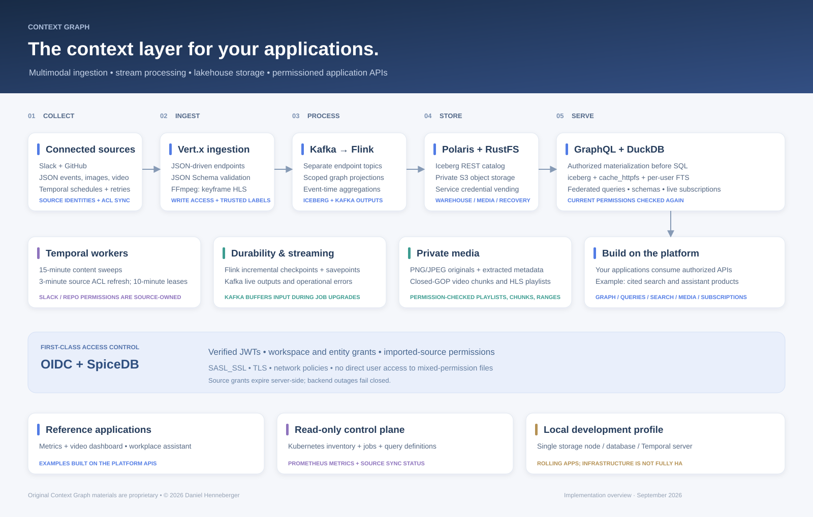
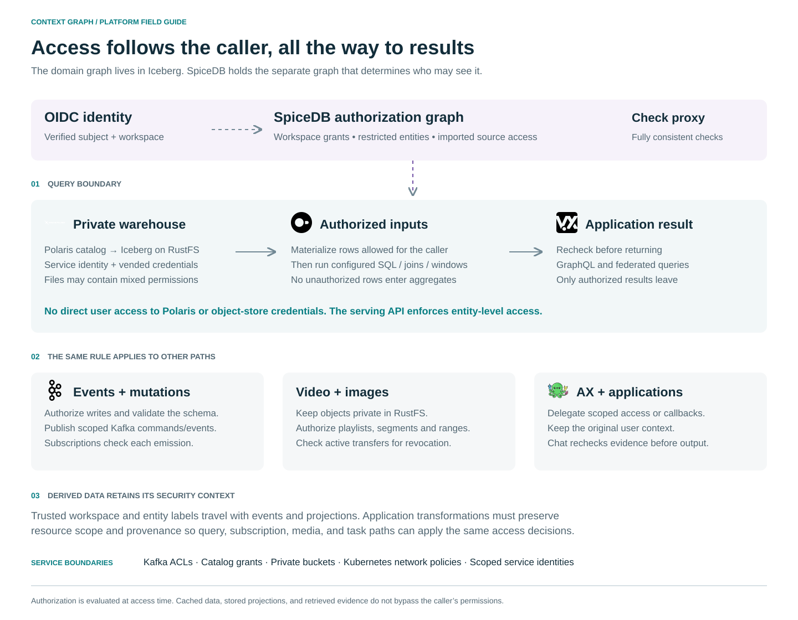
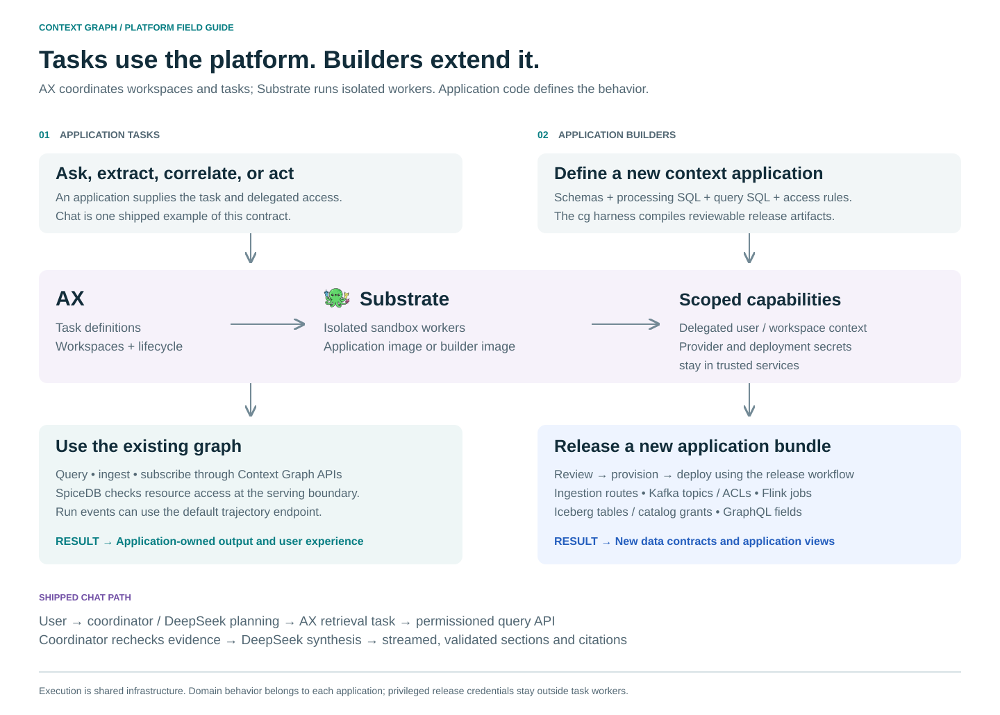

# Context Graph

**A platform for building permissioned context graphs and applications on streaming, schema-defined data.**

> **Proprietary software — non-free and not open source.** Copyright © 2026 Daniel Henneberger. All rights reserved. Use, modification, hosting, and redistribution require a separate written license. See [LICENSE](LICENSE). Third-party components retain their own licenses.

Context Graph connects ingestion, stream processing, a relational lakehouse, graph and SQL queries, permissioned APIs, and isolated task execution. Applications supply their JSON Schemas, SQL, graph and ontology mappings, and behavior. The platform supplies validation, transport, storage, permissions, and operational visibility.

Data lands in Iceberg through dynamic lake ingestion or schema-defined application jobs. Application schemas and SQL transformations define relationships, classifications, and extracted information.

[OrchidDB](services/query/README.md#orchiddb-graph-queries) adds Cypher, Gremlin, and ontology-mapped SPARQL queries over permission-filtered data on the existing DuckDB engine. To get the most from ontology layers, separate physical table/column mappings from a shared domain vocabulary: use stable class and predicate IRIs, explicit subject identities, and named relationships with defined endpoints; reuse those mappings across applications so storage changes do not rewrite business queries. Keep graph IDs unique and stable, version mappings alongside schemas, and test vocabulary queries against representative data and permissions. Ontology mappings describe meaning and relationships; derive classifications or inferred facts explicitly in processing jobs. See the [ontology example](examples/ontology/queries.yaml) and [graph growth and compiler setup](services/query/README.md#growing-the-context-graph).

For lake ingestion without Flink SQL, [DynamicLakeJob](services/processor/LAKE.md) discovers Kafka topics and creates Iceberg tables automatically. It archives arbitrary Kafka records and applies Debezium Postgres CDC updates and deletes to current-row tables. Start with [config/lake.yaml](config/lake.yaml).

Slack and GitHub are example ingestion adapters. Workplace search/chat and the metrics/video dashboard are reference applications. AX task execution and the application harness are shared platform capabilities.

[](docs/diagrams/context-graph-overview.svg)

## Build a lake with DataStream

`DynamicLakeJob` uses Flink's DataStream API and `DynamicIcebergSink`. One Kafka topic-pattern subscription feeds one sink, which creates a separate Iceberg table for each matching topic as records arrive. Newly discovered topics need no per-topic SQL or DDL.

| Input | Iceberg behavior | Stored payload |
| --- | --- | --- |
| Arbitrary Kafka topic | Append every record, including tombstones | Original key/value bytes, ordered headers, topic, partition, offset, timestamp |
| Postgres CDC through Debezium Kafka topics | Snapshot and insert events upsert rows; updates replace rows by primary key; deletes remove rows | Canonical JSON primary key and the latest row in `row_json`, with Kafka source coordinates |

Configure the topic pattern, CDC topic pattern, namespace, parallelism, and checkpoint interval in [config/lake.yaml](config/lake.yaml). The example subscribes to `cg.*` and `postgres.<schema>.<table>`. Each topic maps to `topic_` plus its UTF-8 name encoded as lowercase hexadecimal, avoiding punctuation and case collisions.

With Java 21 and the Kafka/catalog credentials configured, build and submit:

```sh
mvn -pl services/processor -am package -DskipTests
flink run -c io.contextgraph.processor.DynamicLakeJob \
  services/processor/target/processor.jar config/lake.yaml
```

Set `KAFKA_BOOTSTRAP_SERVERS`, `KAFKA_CLIENT_CONFIG` (SASL_SSL properties), and a durable `CHECKPOINT_URI`. Production catalog access uses `POLARIS_URI`, `POLARIS_WAREHOUSE`, and `POLARIS_CREDENTIAL`. Restore checkpoint/savepoint state on restart to resume Kafka offsets. The job runs separately from the application SQL jobs.

Postgres capture uses the [Debezium connector example](config/connectors/postgres-cdc.example.json). Configure logical replication, a publication, primary keys, and `REPLICA IDENTITY FULL` on captured tables. Keep Debezium JSON envelopes intact and preserve event order for each key. The job rejects unsupported CDC operations such as truncate and incomplete updates.

Payload fields are not automatically promoted to typed Iceberg columns: generic records remain bytes and current CDC rows remain JSON. Keep these lake tables in a restricted namespace; application row authorization is supplied by the separate application processing/query path. See [lake setup, recovery, limitations, and validation](services/processor/LAKE.md) for the full operating contract. The live Postgres/Kafka/Polaris path still requires deployment validation.

## JSON Schema for application jobs

Each input endpoint has a JSON Schema and a Kafka topic. Vert.x validates input and stamps authenticated transport metadata. Flink validates again, maps declared fields into relational columns, and persists the dataset to Iceberg. Additional processing is defined in SQL.

Unmapped keys go into **`_json_remainder VARIANT`**. Nested structured objects have their own remainder. Open-ended objects and heterogeneous values use native VARIANT directly.

For example:

```json
{
  "label": "sample",
  "profile": {"active": true, "region": "west"},
  "observations": [1, "two", null, {"ok": true}]
}
```

With a schema declaring `label` and `profile.active`, the stored representation is:

```text
label                    STRING  "sample"
profile                  STRUCT
  active                 BOOLEAN true
  _json_remainder        VARIANT {"region":"west"}
_json_remainder          VARIANT {"observations":[1,"two",null,{"ok":true}]}
```

Declared strings, booleans, bounded integers, exact bounded decimals, nested objects, and arrays get corresponding physical types. Unconstrained and heterogeneous values remain VARIANT. These schema-defined application tables use Iceberg format version 3. Schema validation remains authoritative: a remainder does not permit keys forbidden by the schema.

See the [mapping contract, numeric handling, and reserved columns](docs/json-schema-storage.md).

## Major components

| Component | Responsibility |
| --- | --- |
| Vert.x ingestion | Configured endpoints; JSON Schema validation; authenticated metadata; image and video ingestion |
| Kafka | Separate input topics; error queues; commands and live output streams; scoped service ACLs |
| Flink | DataStream dynamic lake ingestion, CDC upserts, schema adapters, application SQL, and Kafka outputs |
| Iceberg + Polaris | Relational tables, snapshots, catalog metadata, and service credential vending |
| RustFS | Private local S3 object storage for warehouse files, media, and recovery state |
| DuckDB | SQL serving through `iceberg` and `cache_httpfs`; authorized inputs before query execution |
| Authenticated MCP | Read-only dataset discovery and query access for MCP clients, with delegated user permissions |
| Vert.x GraphQL | SQL-derived queries, validated event mutations, Kafka subscriptions over `graphql-transport-ws` |
| OIDC + SpiceDB | Verified identities, workspace/resource permissions, and imported source access |
| AX + Substrate | Task definitions, workspaces, and isolated task workers |
| Application harness | Compile schemas and SQL into reviewable deployment bundles |
| Temporal | Scheduled example source synchronization and retries |
| Control plane | Independent read-only inventory, API/query definitions, Flink status, and metrics |
| PostgreSQL | Authorization, catalog, and connector state |

Flink jobs run as ordinary Kubernetes JobManager/TaskManager deployments. No Flink Kubernetes operator is required. Multiple jobs can produce application-specific datasets and temporal views.

## Build an application

Start with [`examples/schema-data`](examples/schema-data). It demonstrates schema-defined storage without requiring any transformation view, plus derived queries, mutations, and subscriptions.

```sh
mvn -pl services/query,services/processor,services/ingestion -am install
python -m pip install -r services/harness/requirements.txt
python scripts/cg init my-app
python scripts/cg build my-app/bundle.yaml --output my-release
python scripts/cg inspect my-release
```

The bundle defines input schemas, processing jobs, and APIs:

```yaml
version: 1
name: records
workspace: demo
inputs:
  records:
    schema: schemas/record.json
jobs:
  storage:
    sources: [records]
    views: {}
api:
  queries:
    records:
      view: records
      sql: sql/records.sql
  mutations:
    appendRecord: {input: records}
  subscriptions:
    recordAdded: {view: records}
```

Query SQL can select structured fields and the native remainder:

```sql
SELECT label, profile, tags, attributes, _json_remainder
FROM source
ORDER BY event_time DESC
LIMIT 100
```

Mutations take the access resource separately from the document:

```graphql
mutation {
  appendRecord(resourceKey: "project-17", input: {
    label: "sample"
    attributes: {arbitrary: [1, "two", true]}
  }) {
    eventId
    status
  }
}
```

A mutation reports Kafka acceptance; the write becomes queryable after stream processing and an Iceberg snapshot commit. API field types come from query result schemas and input contracts; nested and VARIANT results use the GraphQL JSON scalar.

See the [harness guide](services/harness/README.md) for compilation, rendering, deployment, and promotion. Temporal views are ordinary Flink SQL. The [group activity example](examples/group-insights) demonstrates event-time windows and run-event ingestion.

## Permissions



Bundle ingestion endpoints take `X-Resource-Key` separately from the document. The server verifies the caller's write access and attaches trusted workspace/resource labels. Explicit endpoint bindings can instead select a resource key from a declared JSON Pointer.

SpiceDB evaluates access to resources. SQL transformations must preserve scope; the harness rejects transformations whose allowed scope rules cannot be established.

The serving API materializes authorized rows before configured SQL, joins, or aggregates run, and rechecks access before returning. Subscriptions check permissions per emission. Media playlists, segments, originals, and byte ranges pass through authorization. Task workers receive delegated API access or scoped callbacks.

Polaris and object-storage credentials stay with platform services. End users access mixed-permission datasets through the serving API. The local issuer supports development; APIs also support production OIDC identities.

See [security architecture](docs/security-architecture.md), [network boundaries](docs/network-security.md), and [lakehouse access](docs/lakehouse.md).

## AX task execution



Applications delegate tasks to AX; Substrate runs their worker images in isolated sandboxes. Application code determines what a task does and which outputs it produces. Workers use permissioned platform APIs and can ingest ordinary run events through a configured endpoint.

Builders can run `cg` in an AX workspace to author and compile schemas, processing SQL, and API definitions. Deployment privileges stay with the release workflow.

The shipped workplace assistant uses AX retrieval tasks, a trusted coordinator, DeepSeek planning and synthesis, and streamed citations checked against the caller's permissions. It is one application of the execution infrastructure.

See [AX execution and operations](docs/ax.md).

## Images and streaming video

The ingestion service accepts self-contained PNG/JPEG images and streamed video. It extracts metadata, stores media in private object storage, and publishes metadata to endpoint topics. Video is normalized into independently decodable, keyframe-aligned HLS chunks. Kafka carries media metadata and object references.

Image and video metadata have their own JSON Schemas and relational tables. OCR, transcription, meeting-note extraction, and other application behavior can be added as jobs or AX tasks consuming those datasets.

The [generators](generators/README.md) produce JSON, images, and video for functional and load testing.

## Local Kubernetes and operations

The local platform uses Kubernetes, Docker images, Java 21, Maven, Python, Node.js, and FFmpeg. A compatible separate local cluster hosts AX/Substrate. Explicit Kubernetes contexts are required by deployment commands.

```sh
IMAGE_TAG=schema-v1 ./scripts/build.sh
KUBE_CONTEXT=YOUR_CONTEXT STORAGE_NODE=YOUR_NODE IMAGE_TAG=schema-v1 ./scripts/deploy.sh
```

Configuration lives in [`config`](config); Kubernetes resources live in [`deploy/k8s`](deploy/k8s). Credentials are provisioned as Secrets and excluded from Git. AX configuration and pinned upstream revisions are covered in its operating guide.

The read-only control plane is separate from the example dashboard. It reads Kubernetes and Flink status and exposes configured API/query inventory. Services emit Prometheus metrics; telemetry is collected through the observability deployment.

Incremental RocksDB checkpoints, retained externalized checkpoints, and savepoints use private object storage. API replicas support readiness and graceful drain. Stateful application upgrades still require explicit release handling; a healthy candidate and a Service switch do not imply continuous data history. The local single-node database/storage profile is not highly available.

## Reference application screenshots

The screenshots below show reference applications and the independent control plane.


## Development and verification

```sh
mvn test
npm --prefix services/dashboard test
PYTHONPATH=services/harness python -m unittest discover -s services/harness/tests
```

The schema adapter tests include a real Flink write to Iceberg and SQL reads through DuckDB's Iceberg extension. Security tests cover authorization before aggregation, forged labels, revocation, expiry, and dependency failures. Media tests verify independent keyframe chunks and reject external media references. Broker integration requires the explicit Kafka test environment.

For the running platform, `python scripts/schema-smoke.py --context YOUR_CONTEXT` verifies schema rejection, a nested VARIANT round trip, resource isolation, and completed checkpoints using local fixture credentials.

Historical deployment measurements in [`docs/validation.md`](docs/validation.md) and [`docs/security-validation.md`](docs/security-validation.md) describe the revisions that produced them; they are not validation evidence for a newly rebuilt deployment.

## Documentation

- [Schema mapping and VARIANT storage](docs/json-schema-storage.md)
- [Storage revision validation](docs/schema-runtime-validation.md)
- [Platform architecture](docs/architecture.md)
- [Application harness](services/harness/README.md)
- [AX tasks and workspaces](docs/ax.md)
- [Security](docs/security-architecture.md)
- [Lakehouse and federation](docs/lakehouse.md)
- [Authenticated MCP access](docs/mcp.md)
- [Control plane](docs/control-plane.md)
- [Search reference application](docs/search.md)
- [Architecture diagrams](docs/diagrams/README.md)
