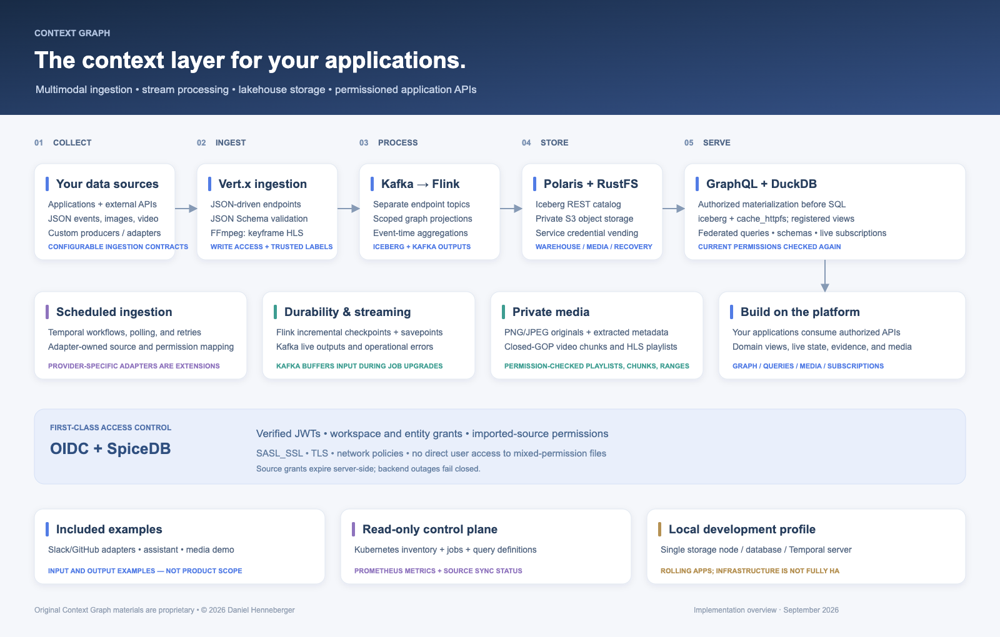
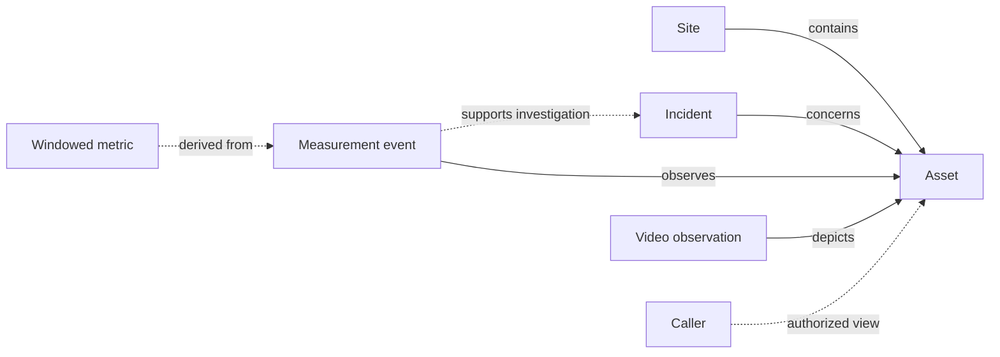
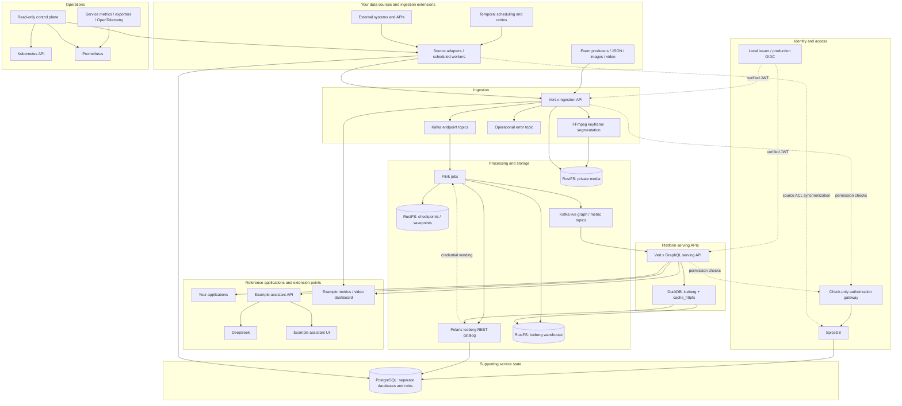
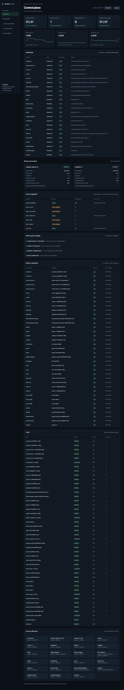
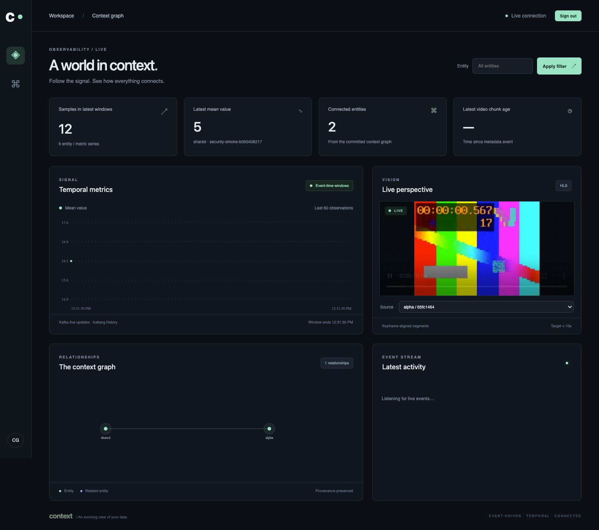
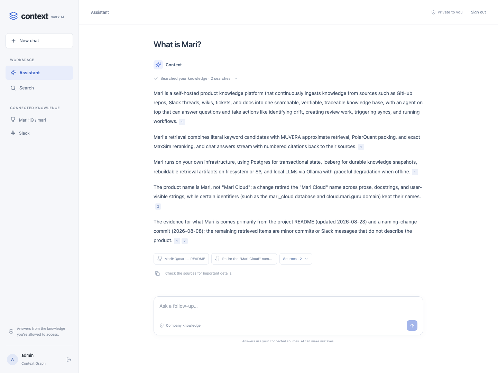

# Context Graph

**A general-purpose platform for building applications on connected, evolving, permissioned data.**

> **Proprietary software — non-free and not open source.** Copyright © 2026 Daniel Henneberger. All rights reserved. Use, modification, hosting, and redistribution require a separate written license. See [LICENSE](LICENSE). Third-party components retain their own licenses.

Context Graph provides the shared context layer between data sources and the applications that use them. It ingests JSON, images, and streaming video; processes events into entity and relationship projections and temporal metrics; persists them in a lakehouse; and serves authorized data through query and subscription APIs.

Application builders define what their entities mean, how their data connects, which transformations produce useful context, and which views their products need. The platform supplies ingestion, transport, processing, storage, permission enforcement, serving, and operational visibility. The same foundation can support operational dashboards, investigation tools, relationship explorers, search products, and AI assistants.

**Slack and GitHub are included ingestion examples. The Glean-style assistant and metrics/video dashboard are example applications built on the platform.** New sources and products integrate through the platform contracts described below. Core graph processing and serving do not require an LLM.

[Context model](#the-context-model) · [Architecture](#architecture) · [Build on the platform](#building-on-the-platform) · [Permissions](#security-and-permissions) · [Configuration](#configuration) · [Local setup](#local-setup) · [Operations](#operations-and-deployment) · [Screenshots](#platform-and-reference-application-screenshots) · [Current limits](#current-scope-and-development-priorities)

[](docs/diagrams/context-graph-overview.svg)

## SQL-backed application harness

The application harness uses **SQL-defined processing and views with derived GraphQL queries, mutations, and subscriptions**. Temporal computations belong in Flink SQL. Mutations publish validated Kafka commands/events and return acceptance receipts; durable processing-status tracking remains a development item. Multiple Flink jobs run on ordinary Kubernetes resources, without the Flink Kubernetes operator.

The [SQL platform design](docs/design/sql-platform.md) records the review of `da-app`, the operation contracts, authorization-preserving optimizations, and migration gates. The [application harness](services/harness/README.md) implements a bounded SQL bundle compiler and release workflow. The core example job retains its legacy transformation configuration but now runs on standard Kubernetes Deployments. The [AX integration](docs/ax-investigations.md) connects task execution to the platform; the search reference application uses it for every assistant question.

## AX task execution

**AX and Substrate connect executable tasks to the context graph.** Applications delegate work to AX, Substrate runs it in a sandbox, and the platform supplies permissioned data and ingestion APIs. The same execution layer can host tooling that builds new applications on the platform.

The workplace assistant is the deployed example: normal chat creates an AX task, retrieves evidence through the caller's SpiceDB permissions, and streams a cited answer. Follow-up questions retrieve fresh evidence. Concurrent requests wait for execution capacity. The coordinator uses DeepSeek for planning and answer generation; the sandbox executes the retrieval plan through scoped callbacks.

For application builders, the AX workspace and builder image package the `cg` tools. A task can initialize and compile a bundle of schemas, Flink SQL, and SQL-backed APIs into reviewable release artifacts. The deployment workflow provisions the resulting APIs, Kafka topics, Flink jobs, and Iceberg tables. Tasks can also use delegated application credentials to query the graph or ingest events, including run events through the example trajectory endpoint.

Read the [AX architecture, execution flow, and operating guide](docs/ax-investigations.md), or start with the [builder task manifest](services/harness/builder/ax.yaml) and [application harness](services/harness/README.md).

## What the platform is for

Useful context connects an observation to the things it concerns, the relationships around those things, when it happened, where it came from, and who can use it. Applications need different views of that shared context: an operator may need recent measurements and video for an asset; an investigator may need related events and their evidence; an assistant may need authorized source material for an answer.

In this project, a **context graph** is that connected representation, together with the pipelines and access rules that keep it usable as new data arrives. The domain graph is stored as Iceberg node, edge, and event tables and queried with DuckDB. SpiceDB maintains a separate authorization graph that determines visibility. GraphQL is the application interface; domain relationships are explicitly represented in the data.

| Boundary | Responsibility |
|---|---|
| Sources and adapters | Supply observations, stable source identifiers, source references, and verified permission mappings |
| Platform | Validate and label events; process streams; retain graph projections and metrics; enforce access; expose configured views and live updates |
| Domain extensions | Define entity types, relationship meaning, identity reconciliation, extraction logic, and application-specific transformations |
| Applications | Compose authorized context into workflows, visualizations, retrieval experiences, and products |

“General-purpose” describes the extensible foundation. It does not mean every source, domain model, or graph algorithm is already implemented. JSON/YAML covers the existing endpoint, projection, aggregation, and query primitives; new semantics can require adapter or processor code.

## The context model

### Entities, relationships, observations, and evidence

| Primitive | Meaning | Representation today |
|---|---|---|
| Workspace | An explicit data and access boundary | `workspaceId` on envelopes; `workspace_id` on stored rows; SpiceDB membership |
| Entity | A stable identifier for something in a domain, such as an asset, account, project, or document | Producer-supplied `entityId`, scoped to a workspace; node projections use this identifier |
| Observation / event | A submitted occurrence or description of an entity | Validated envelope with `eventId`, `eventTime`, `ingestedAt`, `payload`, and trusted security labels |
| Relationship | A directed connection with a declared meaning | Edge projection with source/target IDs, relation, event time, and source-event reference |
| Properties | Domain-specific attributes and source content | Flexible JSON payloads; serialized JSON properties in Iceberg |
| Evidence and provenance | A path back to the observation supporting a projection | Nodes and edges retain `source_event_id`; original event payloads and media references remain queryable |
| Derived measure | A calculation over observations in a time window | Resource-scoped count, sum, average, minimum, and maximum |
| Identity and access | Who can ingest, query, subscribe to, or retrieve an entity's data | Verified OIDC subjects and SpiceDB workspace/entity/source relationships |

A conceptual application could relate an asset to a site, collect measurements and video against that asset, and show an incident alongside the observations that explain it:



This illustrates a domain model an application could build. The shipped projection produces one node per event and at most one configured outgoing relationship; richer typed relationships, incident inference, and per-result derivation links require extensions. Domain relationships such as `contains` do not implicitly grant access.

### Identity and cross-source reconciliation

Entity identity is workspace-scoped. The platform derives a canonical authorization resource ID as `SHA256(workspaceId + NUL + entityId)` and preserves that scope through Kafka, Flink, Iceberg, and serving. Producers must use deliberate, stable entity IDs; ingestion does not decide that two source records describe the same real-world entity.

Cross-source matching, aliases, merge/split policy, and canonical entity ownership belong in domain-specific processing. A new adapter should namespace source identifiers and explicitly map identities when reconciliation is needed. Matching people by display name or unverified email is insufficient for granting access. The example adapters demonstrate trusted source-user mappings, separately from domain entity resolution.

### Time and changing knowledge

The model records **event time** (`eventTime`) and **ingestion time** (`ingestedAt`). Flink uses event time for windowed computation, while append-oriented Iceberg tables retain observations and projection versions. The configured node and edge queries select their latest versions by event time.

That supports event history and recent state, with important boundaries: the current graph does not implement valid-from/valid-to fact intervals, automatic relationship retraction, contradiction resolution, or a complete “what did we know at time T?” API. Iceberg snapshots capture table versions; they do not by themselves establish domain-level temporal truth. Applications needing those semantics must define and implement them explicitly.

### Provenance and derived context

Source-event references let an application connect a node or edge projection to its input observation. Media metadata identifies stored originals or video chunks. A domain adapter can preserve additional source identifiers, revisions, and references in the payload.

Complete derivation chains, model/prompt versions, confidence, decision rationale, and evidence supporting or invalidating individual claims are further modeling work. In particular, the current aggregate rows retain resource scope and window bounds, not an enumerated lineage graph of every contributing event. The example assistant's citations are an application-level use of source evidence.

### Design references

These concerns have established foundations: [W3C PROV](https://www.w3.org/TR/prov-overview/) describes provenance through entities, activities, agents, and derivation; [DataHub's metadata model](https://github.com/datahub-project/datahub/blob/master/docs/modeling/metadata-model.md) illustrates explicit entity identifiers, aspects, and relationships; [Graphiti's temporal graph model](https://help.getzep.com/graphiti/getting-started/overview) illustrates incrementally incorporating episodes into an evolving graph. These are design references, not dependencies or claims that this repository implements their models or conformance standards.

## Implemented platform capabilities

| Area | Available now | Current boundary |
|---|---|---|
| Ingestion | JSON-configured Vert.x endpoints, per-endpoint Kafka topics, JSON Schema validation, operational error topic | Flexible payloads still obey a fixed envelope and configured input contracts |
| Multimodal data | PNG/JPEG metadata and originals; streamed video normalized into independent HLS chunks | OCR, transcription, semantic vision, and entity extraction are extension work |
| Processing | Configurable Flink projections, event-time tumbling aggregations, Iceberg and Kafka outputs | Existing primitives are configured; arbitrary transformations require code |
| Domain graph | Workspace-scoped node/edge projections and source-event references | No automatic entity resolution, ontology lifecycle, or native graph traversal engine |
| Durable storage | Iceberg in private RustFS object storage with a Polaris REST catalog | Cross-table and Kafka/Iceberg commits are not globally atomic |
| Serving | GraphQL, registered schema discovery, parameterized DuckDB queries and federation | Trusted definitions and bounded execution; no end-user arbitrary SQL or raw warehouse access |
| Live context | Kafka-backed GraphQL subscriptions with per-emission authorization | Clients must handle reconnects; this is not a durable client replay API |
| Access | OIDC, SpiceDB, scoped transformations, authorization before SQL, protected media | Imported permission freshness depends on the adapter's synchronization policy |
| Operations | Independent read-only control plane, Kubernetes inventory, job/query visibility, metrics | Current infrastructure is a local development deployment, with single-node dependencies |
| Extension examples | Temporal source workers; permissioned BM25/freshness search; cited assistant; metrics/video UI | Provider mappings and search document projection are example-specific |

## Architecture

[Download the SVG](docs/diagrams/context-graph-overview.svg) · [PNG](docs/diagrams/context-graph-overview.png)

<details>
<summary>Detailed component flow</summary>



</details>

The serving API is the application integration boundary. The control plane has its own API and frontend. Reference applications also run as separate services; their browser routing is described under local setup.

The [platform architecture](docs/architecture.md), [lakehouse design](docs/lakehouse.md), and [example search application](docs/search.md) describe the individual paths. Earlier [interactive](docs/diagrams/context-graph-architecture.html), [SVG](docs/diagrams/context-graph-architecture.svg), and [PDF](docs/diagrams/context-graph-architecture.pdf) diagrams document the core platform; the diagram above includes the subsequently added connector and assistant services.

### Data path

1. An authenticated client or connector submits data to Vert.x. The API checks write access and adds canonical workspace/entity labels.
2. JSON Schema validates input and Kafka envelopes. Metadata is published only after the required storage/publication steps succeed. Ingestion uses acknowledged, idempotent Kafka publication; validation/processing failures have an operational error topic. Authentication failures do not publish attacker-controlled records to that queue.
3. Kafka isolates endpoint streams. Flink consumes labeled events, applies configured transformations, creates graph projections, and calculates temporal metrics.
4. Flink writes Iceberg tables and optional Kafka outputs. Iceberg lives in RustFS; Polaris supplies catalog operations and service credential vending.
5. The serving API checks the caller's permissions, materializes authorized source rows, then runs configured SQL. Kafka feeds authorized live subscriptions.
6. Downstream applications use these APIs to build products. The included assistant demonstrates authorized retrieval and checks every model input before releasing each cited paragraph.

### Technology profile

These are pinned repository versions, not an assertion that every component is the latest release:

| Layer | Technology |
|---|---|
| Java services | Java 21, Vert.x 5.2.0 |
| Streams | Kafka 4.1.1, Flink 2.3.0, Flink Kubernetes Operator 1.16.1 |
| Tables / queries | Iceberg 1.11.0, DuckDB JDBC 1.5.5.1; `iceberg`, `cache_httpfs`, `fts` |
| Catalog / storage | Polaris 1.7.0, RustFS 1.0.0-beta.8 |
| Authorization | SpiceDB 1.56.2, verified OIDC JWTs |
| Supporting database | PostgreSQL 17.6, separated service databases/roles |
| Scheduled ingestion | Temporal Python SDK; local persistent Temporal development server |
| Frontends | React, TypeScript, shadcn components, nginx; hls.js in the video demo |
| Example assistant | DeepSeek Flash through the example search API |
| Telemetry | Prometheus, service metrics, exporters, OpenTelemetry collector |

The Kafka/Iceberg connector compatibility checks are application-specific evidence for this Flink profile. A custom connector fork is not required by the current implementation; schema handling is implemented at the application boundary.

## Building on the platform

### 1. Define the domain and access boundary

Choose a workspace, stable entity IDs, and the resource granularity at which access must differ. Decide which source owns each identifier, what relationships mean, and how changes or deletions should be represented. Provision write/read grants through trusted administration before sending data.

The current local-entity model is workspace-wide visibility with restricted entities. Imported entities additionally depend on verified source grants. An application's data model and its permission model must agree: placing unrelated restricted records under one entity would collapse their authorization boundary.

### 2. Add an ingestion contract

Add an endpoint in [config/ingestion.json](config/ingestion.json), its input schema in [config/schemas/](config/schemas/), and the corresponding Kafka topic and service ACLs. For a JSON endpoint, the configuration has this shape:

```json
{
  "path": "/ingest/observations",
  "name": "observations",
  "kind": "json",
  "topic": "cg.secure.observations",
  "schema": "schemas/event-input.json"
}
```

This is an illustrative new endpoint, not a preinstalled route. Configure the processor to consume its topic and deploy the associated broker provisioning and service configuration.

A producer can submit the following body to the existing `/ingest/events` endpoint, using a verified bearer token and `X-Workspace-Id`, after the referenced entities and permissions are provisioned:

```json
{
  "entityId": "asset-42",
  "eventTime": "2026-09-24T12:00:00Z",
  "entityType": "asset",
  "relatedTo": "site-7",
  "metric": "temperature",
  "value": 21.4,
  "unit": "celsius"
}
```

The API supplies event identity, ingestion time, and trusted `security` labels. Clients cannot assert those labels. JSON Schema draft 2020-12 validates the input and emitted envelope; Flink validates consumed envelopes and configured outputs. The payload remains flexible within those contracts. Kafka's upstream string/byte connector is sufficient; flexible JSON does not require a connector fork.

Images and video use raw upload endpoints and `X-Entity-Id`. Their bytes are stored privately; metadata and references enter Kafka. See [ingestion contracts](services/ingestion/README.md) for formats, limits, responses, and error behavior.

### 3. Define SQL processing and temporal views

The replacement authoring model is Flink SQL: projections, joins, and event-time windows produce registered views, with SQL result schemas feeding the application contract. Related sink INSERTs execute in a StatementSet; independent jobs have separate lifecycle and recovery identities. See the [SQL processing design](docs/design/sql-platform.md#flink-sql-replaces-the-fixed-aggregation-configuration) for a concrete windowed view and its Kafka/Iceberg outputs.

The currently deployed processor still reads [config/jobs.yaml](config/jobs.yaml), emits the `events`, `nodes`, `edges`, and `metrics` tables, and uses fixed graph/aggregation primitives. That configuration is a legacy implementation detail scheduled for replacement, not the intended application-building API. Existing rows preserve workspace/resource labels and source-event references; edges also retain their target-resource scope.

### 4. Publish application views

The target compiler derives GraphQL result types from prepared SQL metadata and operation bindings. The following examples document the **current** serving configuration, which still includes handwritten signatures pending that migration.

Register authorized Iceberg sources and named queries in [config/queries.yaml](config/queries.yaml). The serving API combines registered schema information with configured GraphQL types and fields. DuckDB uses `iceberg` and `cache_httpfs` for lakehouse access.

For example, the shipped configuration defines:

```yaml
metricTotals:
  signature: 'metricTotals(metric: String!): [MetricTotal!]!'
  table: context_secure.metrics
  sql: >-
    SELECT metric, sum(sample_count) AS sample_count,
           sum(sum_value) AS sum_value
    FROM source WHERE metric = :metric GROUP BY metric
```

An application calls `/graphql` with its bearer token and workspace:

```graphql
query {
  metricTotals(metric: "temperature") {
    metric
    sample_count
    sum_value
  }
  nodes(limit: 20) {
    node_id
    node_type
    source_event_id
  }
  edges(limit: 20) {
    source_id
    target_id
    relation
  }
}
```

The serving API materializes authorized inputs **before executing configured SQL**, so totals are computed from visible contributors. Federated queries authorize each registered source before joining it; the shipped `entityMetrics` query demonstrates joining nodes and metrics. Request values are bound parameters. Schema discovery excludes unregistered sources and physical credential-bearing metadata.

Applications receive structured results through this boundary. Direct Polaris/object-store credentials are reserved for trusted services because files can mix rows with different permissions.

### 5. Subscribe and compose an application

Use `graphql-transport-ws` for live subscriptions. Initialize the connection with:

```json
{
  "type": "connection_init",
  "payload": {
    "authorization": "Bearer <JWT>",
    "workspaceId": "demo"
  }
}
```

Then send a protocol subscription request for fields such as:

```graphql
subscription {
  metricUpdated(entityId: "asset-42") {
    entity_id
    metric
    window_end
    avg_value
  }
}
```

Use the workspace in which the entity was provisioned. Kafka output topics feed subscription routes and Reactor Flux consumers. Each serving replica has its own consumer group for delivery to its connected clients, with bounded buffers, cancellation, expiry, and permission checks on emissions. Iceberg supplies durable query state; subscriptions supply live updates.

An application can combine these views with protected media, domain-specific queries, and its own interface. AI applications must preserve evidence references and maintain authorization through derived outputs; the included assistant demonstrates that pattern. External actions, workflow approvals, and write-back to source systems are application responsibilities, not a general action engine currently supplied here.

## Security and permissions

### Local entities

Workspace members can view unrestricted entities. Restricted entities require an explicit reader/writer grant or workspace administration. Ingestion requires an explicit writer grant or workspace administration. The demo fixture gives Alice access to `alpha`/`shared`, Bob to `beta`/`shared`, and producer write access to the demo entities. The `other` workspace remains isolated.

### Imported sources

Imported entities do **not** inherit workspace-admin visibility bypasses. Reading requires workspace access **and** an applicable source grant. An ingestion adapter is responsible for translating its source system's verified access rules into these grants; the platform enforces them when serving data.

In the included examples, the Slack adapter conservatively grants active human channel members access, and the GitHub adapter distinguishes public repositories from verified private-repository readers. A different source adapter must implement its own permission mapping against the same platform authorization contract.

Source grants support SpiceDB server-side relationship expiration. The example adapter configuration refreshes permissions every three minutes with ten-minute leases. Failed refreshes attempt immediate revocation; unavailable infrastructure cannot renew the lease. Remote revocation is therefore bounded by polling/lease expiry, not instantaneous. Local serving checks use fully consistent SpiceDB reads.

### End-to-end enforcement

- JWT signature, issuer, audience, and expiry are verified. Caller-supplied identities and security labels are not trusted.
- Canonical resource labels are derived from workspace and entity. Flink preserves scope through transformations and aggregation keys.
- SQL executes on authorized, materialized input rows **before** aggregation. Graph edges require permission on both endpoints.
- Query results and model inputs are rechecked. Authorization failures deny access rather than falling back to unfiltered data.
- GraphQL subscriptions use `graphql-transport-ws`, bounded buffers, per-emission checks, cancellation, and expiry handling.
- Media paths, playlists, byte ranges, and chunks require current access. Cookie sessions do not authorize writes.
- Kafka uses SASL_SSL with service-specific ACLs. TLS and network policies isolate internal services.

The domain graph and authorization graph have separate purposes: adding an edge between domain entities does not grant access. Authorization is enforced on the inputs and outputs of graph queries, not just at the browser or GraphQL field boundary. Configurable SQL runs in a credential-free DuckDB execution context with external access disabled and its configuration locked.

Polaris supplies service-level catalog privileges and temporary warehouse credentials. SpiceDB supplies user-level entity permissions in the serving API. Because individual Parquet files can contain rows with different permissions, **users must not receive raw Polaris/S3 access to those files**. New applications should use the serving API.

PostgreSQL persists SpiceDB and Polaris state and connector bookkeeping in separate databases/roles. It is not the analytical query engine. Connector bookkeeping stores identities, fingerprints, and tombstone metadata, not a second full-text corpus.

See [security architecture](docs/security-architecture.md), [network boundaries](docs/network-security.md), and [source authorization](docs/search.md) for trust assumptions, exact contracts, and deployment-specific limits.

## Configuration

| File | Controls |
|---|---|
| [config/ingestion.json](config/ingestion.json) | Endpoint paths, topics, schemas, upload limits |
| [config/schemas/](config/schemas/) | Input, envelope, and output JSON Schemas |
| [config/jobs.yaml](config/jobs.yaml) | Flink sources, graph projections, event-time windows, sinks |
| [config/query.yaml](config/query.yaml) | Query workers, queues, memory/time/row/resource bounds |
| [config/queries.yaml](config/queries.yaml) | Registered Iceberg tables, GraphQL fields, SQL, search ranking, subscriptions |
| [config/connectors/sources.yaml](config/connectors/sources.yaml) | Bundled adapter examples: provider-specific scope, schedules, identity links |
| [config/security/schema.zed](config/security/schema.zed) | Workspace, entity, source, and external-identity permissions |
| [deploy/k8s/](deploy/k8s/) | Workloads, storage, services, metrics, and network policies |

Configuration is trusted deployment input. End users cannot submit arbitrary SQL or redefine security labels. The renderer creates versioned service-specific ConfigMaps. Workers reconcile schedule settings at startup; roll them after changing schedule configuration.

## Operations and deployment

### Control plane and metrics

The control plane reads namespace-scoped Kubernetes inventory, referenced API/query/job definitions, connector status, and bounded Prometheus summaries. It cannot read Secrets, execute commands in pods, modify deployments, or run arbitrary queries. Platform administration is separate from workspace membership.

Annotated service replicas expose internal Prometheus metrics for API latency/status, search/model outcomes, connector ingestion, Flink, Kafka, PostgreSQL, Polaris, SpiceDB, RustFS, Temporal, and frontend traffic. See [control-plane operations](docs/control-plane.md).

### Recovery and rollouts

- Flink uses incremental RocksDB checkpoints, retained checkpoints/savepoints, and Kubernetes HA metadata. Recovery objects live in `s3://context-recovery`.
- The warehouse and media use separate RustFS buckets and service identities. Polaris vends scoped warehouse credentials to trusted readers/writers.
- APIs/frontends/workers use replicas, readiness, graceful termination, and disruption budgets for rolling deployment.
- Savepoint upgrades can pause output while Kafka retains input. Existing WebSockets and active video uploads may need to reconnect.
- [Versioned Flink upgrades](docs/upgrades.md) isolate consumer groups, transaction prefixes, topics, and tables for candidate/rollback workflows; they require spare capacity.

For an existing installation, `scripts/provision-connectors.py` provisions connector/search secrets and `scripts/deploy-search.py` stages their release. Do not replay storage migrations or delete persistent volumes as a normal application update.

### Troubleshooting

| Symptom | Check |
|---|---|
| Stale page or port-forward failure after rollout | Restart the dashboard forward and reload `/search` |
| Workspace unavailable | Correct local account, selected workspace, and SpiceDB grants; demo and knowledge membership differ |
| Slack `not_in_channel` | Invite the bot to the channel; wait for or trigger the next content sweep |
| Missing replies or partial source | Inspect connector status for source scopes/rate limits; incomplete snapshots do not infer deletions |
| No recent aggregate | Event-time watermark advancement, Kafka lag, and completed Flink checkpoints |
| Missing Iceberg updates | Flink job state/checkpoints, Polaris access, object storage, and source status |
| Interrupted assistant response | Retry after checking source authorization, source changes, DeepSeek availability, and search error metrics |
| New pods cannot communicate | NetworkPolicy enforcement and explicit allow rules; do not disable authorization as a workaround |

## Included adapters and reference applications

The repository includes working integrations to exercise the platform end to end. Their source-specific behavior belongs to the examples; adding an unrelated domain does not require adopting their document model or user experience.

| Example | What it demonstrates |
|---|---|
| Slack and GitHub adapters | Scheduled Temporal polling, endpoint/topic separation, stable source IDs, source-user mapping, expiring source grants, and tombstones |
| Workplace search and assistant | Authorized document retrieval, BM25 with recency weighting, streamed cited answers, and follow-up questions |
| Metrics/video dashboard | Structured queries, graph views, temporal metrics, and protected chunked video |
| JSON/image/video generators | Authenticated producers, schema variation, temporal disorder, and media load |

The source workers currently implement those two providers in code; they are not a universal declarative connector SDK. A new adapter must implement its own source pagination, retries, revisions/deletion semantics, identity mapping, and permission synchronization. The example search projection specifically understands their document payloads; generalizing search to another source requires a compatible projection or engine changes.

### Workplace search and assistant

The included Glean-style reference application at the `/search` route demonstrates the platform’s retrieval and permission APIs. Its experience is a conversation: ask a question, see live retrieval activity, receive cited paragraphs as they are generated, inspect sources in a side panel, and ask follow-ups. Traditional document search is a separate view.

#### Retrieval and ranking

This reference application is demonstrated using the example Slack and GitHub adapters: messages/replies, README content, issues, PRs, comments/review comments, and default-branch commit messages. Complete snapshots detect removals and emit tombstones. Stable document IDs and fingerprints make retries replay-safe; the current-document projection resolves duplicate versions.

The serving API builds an ephemeral DuckDB FTS index from the caller's current authorized documents. Ranking uses:

```text
score = BM25 × (1 + recencyWeight × freshness) × (1 + titleBoost) × typeWeight
freshness = 2 ^ (-ageDays / halfLifeDays)
```

[Query configuration](config/queries.yaml) controls weights and half-lives. Defaults favor recent messages, allow longer relevance for repository documentation, and distinguish document types. Source/date filters and newest-first sorting are available. Initial assistant retrieval balances Slack and GitHub so short chat matches cannot exclude all repository context.

This is lexical retrieval with freshness weighting, **not embedding/vector search or a reproduction of Glean's complete ranking system**.

#### Answers and streaming

Every assistant question runs through AX. The coordinator uses DeepSeek to plan keyword searches, delegates their execution to a Substrate sandbox, and generates an answer from the returned authorized evidence and short citation IDs. The API consumes provider streaming output and emits SSE activity and complete paragraphs. Each paragraph is withheld until its citation IDs and current source permissions are checked. This is real incremental delivery, not simulated typing or disclosure of internal model reasoning.

Follow-ups pass previous user questions as context and retrieve authorized evidence again. They do not reuse previous assistant text as an authoritative source. Malformed output can be regenerated once; fabricated IDs are never repaired by guessing. Stream errors clear the current answer. Citation validation proves provenance and access, not the semantic correctness of every model interpretation.

Only authorized source text is sent to DeepSeek. Credentials and document bodies are not logged as operational messages or metrics labels. See the [search implementation](docs/search.md) and [AX execution flow](docs/ax-investigations.md).

## Platform and reference-application screenshots

These screenshots show the running platform and included reference applications with demonstration data.

**Platform control plane** — infrastructure inventory, Flink jobs, source status, query definitions, and metrics.

<details>
<summary>View the read-only platform control plane</summary>



</details>

**Multimodal reference application** — graph relationships, temporal metrics, and protected keyframe-aligned video.



<details>
<summary>Glean-style reference application built on the platform</summary>

The assistant demonstrates permissioned retrieval, streamed answers, and citations. It is one application on the platform.



</details>

## Local setup

### Prerequisites

- A local Kubernetes cluster, Docker, `kubectl`, and Helm.
- Python 3.11+ for provisioning and test tools.
- Java 21 and Maven for Java development/tests.
- Node.js/npm for frontend development; Docker builds use pinned Node images.
- FFmpeg/ffprobe for media generation and media tests.
- Network access for container images, extensions, source APIs, and DeepSeek.
- Sufficient CPU, memory, and persistent disk for three brokers, Flink, storage, database, and supporting services. The working development cluster is Docker Desktop; capacity is workload-dependent.

The storage profile pins workloads to one explicitly selected node. The supplied image names assume the Kubernetes node can access locally built images. With another cluster runtime, import those images into the node or publish them to your own registry and update the deployment image references.

### 1. Install provisioning dependencies

```sh
python3 -m venv .venv
. .venv/bin/activate
python -m pip install -r scripts/security-requirements.txt
export KUBE_CONTEXT=docker-desktop
export STORAGE_NODE=docker-desktop
```

Substitute your actual context and node hostname. Deployment scripts require explicit cluster selection; they install/enforce network policies and provision persistent resources.

### 2. Configure the bundled example deployment

The checked-in deployment script currently provisions the platform **together with its reference adapters and applications**. Consequently, running this particular profile requires credentials for the bundled examples. These providers are not requirements of the platform's ingestion contract. A separate core-only deployment profile has not yet been packaged.

The following credentials belong to the **Slack/GitHub adapter and assistant examples**, not to the general-purpose platform. The prompts do not echo secrets or place them in shell history:

```sh
python - <<'PY'
import getpass, json, os
from pathlib import Path
os.umask(0o077)
path = Path('.runtime/security/connector-credentials.json')
path.parent.mkdir(parents=True, exist_ok=True)
if path.exists():
    raise SystemExit('Credential file already exists; update it deliberately.')
data = {
    'github_token': getpass.getpass('GitHub token: '),
    'slack_bot_token': getpass.getpass('Slack bot token: '),
    'deepseek_api_key': getpass.getpass('DeepSeek API key: '),
}
path.write_text(json.dumps(data))
path.chmod(0o600)
PY
```

Use a GitHub token that can read the selected repository's metadata, contents, commits, issues, and pull requests. Slack needs user/channel enumeration and history access for the intended channel types; thread access must also be available. Invite the bot to the channels it should ingest. Polling does not require a Slack signing secret or an app-level socket token. Connector errors surface missing scopes and inaccessible channels rather than treating partial reads as complete.

Review [config/connectors/sources.yaml](config/connectors/sources.yaml) before running these examples. The sample adapter configuration selects `MariHQ/mari` and readable Slack channels. This is example data-source configuration, not platform-wide scope. Its identity links are deployment-specific; replace them for another installation. Do not infer identity links from display names.

### 3. Build and deploy the supplied profile

```sh
./scripts/build.sh
KUBE_CONTEXT="$KUBE_CONTEXT" STORAGE_NODE="$STORAGE_NODE" \
  PYTHON="$VIRTUAL_ENV/bin/python" ./scripts/deploy.sh
```

The default build preserves the per-service tags used in the manifests. If you choose a custom `IMAGE_TAG`, use the same value for build and deploy.

Provisioning creates local certificates/credentials under `.runtime/security/`, Kubernetes Secrets, role-separated database/storage/broker identities, RustFS/Polaris resources, native Flink Deployments, and application workloads. Keep those private files and backups secure. They are intentionally excluded from Git.

This is the documented deployment workflow for the implemented profile, not a promise that a clean installation on every Kubernetes distribution has been tested. Existing local storage migrations and recovery checks are documented separately in [lakehouse operations](docs/lakehouse.md).

### 4. Provision the local demo and source schema

Keep an operator-only SpiceDB forward open in another terminal:

```sh
kubectl --context "$KUBE_CONTEXT" -n context-graph \
  port-forward service/spicedb 18443:8443
```

Then apply the development fixture and stage the search release:

```sh
python scripts/permissions.py bootstrap
python scripts/deploy-search.py --context "$KUBE_CONTEXT" --node "$STORAGE_NODE"
```

The fixture creates the demo workspace and its grants; the search release installs the imported-source schema and broker topic/ACL provisioning. Source workers establish the configured knowledge-workspace identities and source grants. Administrative provisioning is distinct from ingestion: generators never grant themselves permissions.

### 5. Open the local reference applications

Run each forward in its own terminal:

```sh
kubectl --context "$KUBE_CONTEXT" -n context-graph \
  port-forward service/dashboard 18088:8080

kubectl --context "$KUBE_CONTEXT" -n context-graph \
  port-forward service/control-ui 18089:8080
```

| Application | Route after port forwarding | Access |
|---|---|---|
| Metrics/video demo | `/` on the dashboard forward | Select `demo`; use a provisioned demo identity |
| Workplace assistant | `/search` on the dashboard forward | Existing local credentials; knowledge-workspace access required |
| Read-only control plane | `/` on the control-ui forward | Separate platform administrator permission |

Local passwords are generated in `.runtime/security/credentials.json`; there is no checked-in default password. The `admin` account has the local demo/platform grants, and the configured source identity links grant its knowledge access. Alice/Bob demonstrate disjoint demo access; they do not automatically gain knowledge-workspace access.

Browser tokens stay in memory and expire. A port forward ends when its selected pod is replaced; restart it after a rollout if necessary. Loopback HTTP is a development entry point. A non-local browser deployment requires a properly configured TLS ingress and production identity flow.

## Generators and media

Acquire a producer token without printing it:

```sh
python generators/login.py --username producer \
  --token-file .runtime/security/producer-token.json

python generators/load.py json --token-file .runtime/security/producer-token.json \
  --workspace demo --entity alpha --entity shared --related-to shared \
  --rate 50 --concurrency 4 --duration 30

python generators/load.py images --token-file .runtime/security/producer-token.json \
  --workspace demo --entity alpha --rate 2 --duration 15

python generators/load.py video --token-file .runtime/security/producer-token.json \
  --workspace demo --entity alpha --rate 0.05 --concurrency 1 \
  --duration 1 --stream-seconds 30
```

Generators support schema variation, malformed data, timestamp disorder, and video GOP controls. They only target already-provisioned entities. Token files can be refreshed atomically; long uploads must reconnect when their original authorization expires.

Video is transcoded to normalized, closed-GOP output with approximately two-second independent HLS segments. This guarantees decodable chunk boundaries rather than preserving every original input keyframe. Complete chunks are uploaded before playlist references and metadata are published. Playback targets roughly ten seconds or less on adequate hardware; it is not an unconditional latency guarantee. Clients must inspect the final NDJSON upload record for completion/errors.

See [generator documentation](generators/README.md), [ingestion behavior](services/ingestion/README.md), and the [metrics/video demo](docs/dashboard-secure.png).

## Validation

Run local checks with the corresponding development dependencies installed:

```sh
mvn test
npm --prefix services/dashboard ci
npm --prefix services/dashboard test
npm --prefix services/search-ui ci
npm --prefix services/search-ui run build
python -m unittest discover -s generators
python -m unittest discover -s scripts -p 'test_*.py'
```

Search/connector tests additionally use their service requirements:

```sh
python -m pip install -r services/search-api/requirements.txt \
  -r services/connectors/requirements.txt
python -m unittest discover -s services/search-api -p 'test_*.py'
python -m unittest discover -s services/connectors -p 'test_*.py'
```

Live checks require the deployed stack and private local credentials:

```sh
python scripts/source-permissions-smoke.py
python scripts/search-smoke.py --context "$KUBE_CONTEXT"
python scripts/search-smoke.py --context "$KUBE_CONTEXT" --ask
python scripts/control-smoke.py --context "$KUBE_CONTEXT"
python scripts/security-smoke.py --help
```

`--ask` makes a real DeepSeek request. The full security smoke uses fixture writes and revocations; review its options and [security validation](docs/security-validation.md) before running it against shared data. Some development scripts default to `docker-desktop`; inspect their options before targeting another cluster.

Recorded evidence includes [streamed Mari answers](docs/evidence/streaming-search.json), [assistant browser checks](docs/evidence/assistant-browser.json), [source lease expiry](docs/evidence/source-permissions.json), [pipeline security](docs/evidence/search-pipeline-security.json), and [control-plane checks](docs/evidence/control-plane.json). These record particular runs, not continuous guarantees or general capacity benchmarks.

## Repository layout

```text
config/                    Endpoint, schema, job, query, connector, and ACL configuration
deploy/                    Kubernetes manifests, native Flink jobs, and optional AX deployment
docs/                      Architecture, security, operations, screenshots, evidence
generators/                Authenticated JSON, image, and video load tools
scripts/                   Provisioning, rendering, deployment, migration, validation
services/
  security/                Shared Java identity and authorization contracts
  identity/                Local development identity issuer
  check-proxy/             Check-only SpiceDB gateway for serving services
  ingestion/               Vert.x ingestion and protected media delivery
  processor/               Flink processing and lakehouse integration
  query/                   GraphQL, DuckDB federation, search, subscriptions
  connectors/              Example Slack/GitHub adapters implemented as Temporal workers
  search-api/              Authorized retrieval and DeepSeek streaming answers
  search-ui/               Conversational workplace frontend
  dashboard/               Metrics/video demo and local route to /search
  control/                 Read-only Kubernetes/metrics inventory API
  control-ui/              Independent operations frontend
  kafka/                   Broker image and observability integration
```

`.runtime/`, `.data/`, build output, credentials, and local dependency directories are excluded from source control.

## Current scope and development priorities

The foundation is implemented and exercised on local Kubernetes. The following boundaries matter when building on it:

| Area | Current limit / further work |
|---|---|
| Domain modeling | Add a versioned type/relationship registry, domain constraints, cross-source reconciliation, and entity merge/split semantics as needed |
| Temporal facts | Implement explicit validity intervals, retraction/invalidation, correction policies, and historical fact queries for domains that require them |
| Provenance | Extend source-event references into derivation chains, evidence attribution, and transformation/model version tracking |
| Graph retrieval | Add domain traversal/query patterns; a native graph engine, semantic extraction, and embeddings are not currently implemented |
| Schema evolution | Input/output contracts exist; coordinated compatibility policy and migration tooling across producers, jobs, tables, and APIs need further work |
| Delivery semantics | HTTP retries can duplicate logical events; Kafka and Iceberg commits are independent. Do not assume platform-wide exactly-once or globally atomic snapshots |
| Deletion and retention | Example adapters emit logical tombstones; generic graph retraction, media retention, and physical historical-data erasure need explicit lifecycle policies |
| Scale | Query materialization is bounded. Example search rebuilds an authorized FTS index per request, limited to 10,000 current documents / 16 MiB of text |
| Source freshness | Example full scans restart after interruption; content changes follow polling, and source authorization follows refresh/lease expiry |
| Availability | The local RustFS instance, PostgreSQL instance, and selected storage node are single points of failure; Temporal is a persistent development server |
| Deployment packaging | The supplied deployment bundles the platform and examples; a separate core-only profile is not yet packaged |
| Production hardening | Production identity/browser flow, external TLS ingress, certificate rotation, HA storage/database, backup/restore, retention, and capacity sizing need deployment-specific work |
| Privileged operations | Cluster/node administrators are trusted. The example connector holds SpiceDB mutation credentials behind network policy; a narrower mutation broker would reduce privilege |

Rolling application deployments and Flink recovery reduce interruption, but the local stack does not guarantee zero downtime for all components. Existing WebSockets/video uploads can need reconnection, and savepoint upgrades can pause processing while Kafka buffers input. Treat the recorded test runs as evidence for specific configurations, not as an SLA or capacity benchmark.

## License

**Context Graph is proprietary, non-free, and not open source.** No permission to use, modify, distribute, sublicense, host, or commercialize the original software is granted by access to this repository. A separate written agreement with Daniel Henneberger is required, subject to the exceptions stated in [LICENSE](LICENSE).

Open-source dependencies and third-party components remain under their respective licenses; this project's proprietary terms do not replace them. See [THIRD_PARTY_NOTICES.md](THIRD_PARTY_NOTICES.md). Contact [henneberger](https://github.com/henneberger) for licensing inquiries.
