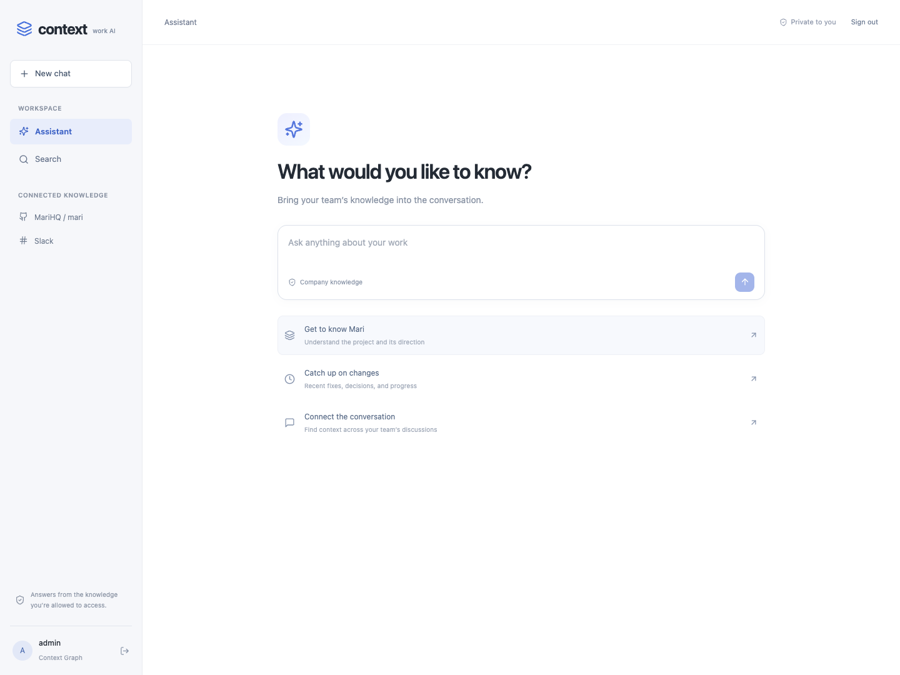
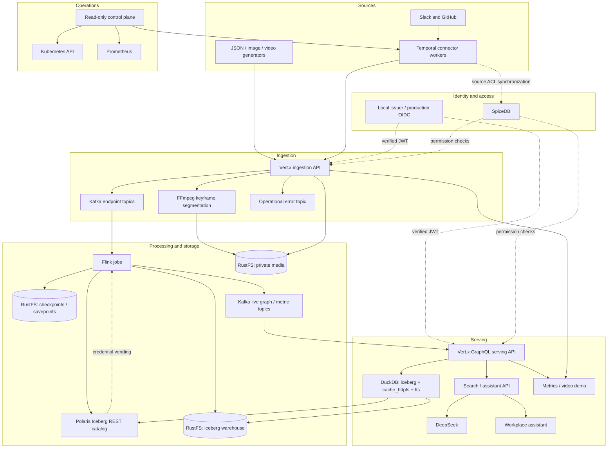

# Context Graph

**A permissioned streaming knowledge platform with multimodal ingestion, a queryable context graph, and a source-grounded workplace assistant.**

> **Proprietary software — not free software and not open source.** Copyright © 2026 Daniel Henneberger. All rights reserved. Use, modification, hosting, and redistribution require a separate written license. See [LICENSE](LICENSE). Third-party components retain their own licenses.

Context Graph turns JSON events, images, video, Slack conversations, and GitHub activity into a shared, permissioned data foundation. Applications consume it through authenticated APIs rather than gaining direct access to the underlying files. A conversational assistant, a metrics/video demo, and a read-only operations console demonstrate how to build on that foundation.

[Screenshots](#screenshots) · [Architecture](#architecture) · [Local setup](#local-setup) · [Security](#security-and-permissions) · [Search](#workplace-search-and-assistant) · [Configuration](#configuration) · [Operations](#operations-and-deployment) · [Limitations](#current-scope-and-limitations) · [License](#license)



## What is implemented

| Capability | Implementation |
|---|---|
| Configurable ingestion | Vert.x endpoints defined in JSON; a separate Kafka topic per endpoint |
| Flexible JSON | Arbitrary payload fields inside a validated, server-labeled envelope; JSON Schema draft 2020-12 validation |
| Images | PNG/JPEG ingestion, metadata extraction, private object storage, permission-checked delivery |
| Streaming video | Backpressured FFmpeg ingestion, closed-GOP keyframe-aligned HLS segments, live playback |
| Stream processing | Configurable Flink transformations, event-time aggregations, graph projections, Iceberg and Kafka sinks |
| Lakehouse | Iceberg tables in RustFS object storage, registered in Apache Polaris |
| Serving API | Generated/configured GraphQL fields, federated DuckDB queries, schema discovery, Kafka-backed subscriptions |
| Authorization | Verified OIDC identities, SpiceDB workspace/entity/source permissions, fail-closed checks |
| Source connectors | Temporal schedules for Slack and a GitHub repository allowlist, source identities, ACL synchronization, deletion handling |
| Workplace assistant | Lexical BM25 plus freshness weighting, streamed cited paragraphs, follow-ups, and source inspection |
| Operations | Separate read-only control frontend/API, Kubernetes inventory, source status, Prometheus metrics |
| Validation | Unit tests, real-service security checks, source-permission expiry checks, media tests, and browser evidence |

This is a functioning local Kubernetes implementation, not a claim of production certification or complete Glean feature parity. The graph currently contains entities, labeled events, configurable nodes/edges, source relationships, and user access relationships. Automatic extraction of a complete organizational ontology is future work.

## Screenshots

The screenshots show the running application and local demonstration data, not design mockups.

**Cited workplace answers** — a real answer about Mari, grounded in repository evidence.


<details>
<summary>Metrics, context graph, and keyframe-aligned video demo</summary>


</details>

<details>
<summary>Read-only control plane: workloads, jobs, sources, queries, and metrics</summary>


</details>

## Architecture

[](docs/diagrams/context-graph-overview.svg)

[Download the SVG](docs/diagrams/context-graph-overview.svg) · [PNG](docs/diagrams/context-graph-overview.png)

<details>
<summary>Detailed component flow</summary>



</details>

The demo nginx service provides the local browser entry point. `/search` routes to a **separate search frontend deployment**; the assistant backend is also separate. The control frontend and API deploy independently.

The [detailed architecture documentation](docs/architecture.md), [lakehouse design](docs/lakehouse.md), and [search design](docs/search.md) describe the individual paths. Earlier [interactive](docs/diagrams/context-graph-architecture.html), [SVG](docs/diagrams/context-graph-architecture.svg), and [PDF](docs/diagrams/context-graph-architecture.pdf) diagrams document the core platform; the diagram above includes the subsequently added connector and assistant services.

### Data path

1. An authenticated client or connector submits data to Vert.x. The API checks write access and adds canonical workspace/entity labels.
2. JSON Schema validates input and Kafka envelopes. Metadata is published only after the required storage/publication steps succeed.
3. Kafka isolates endpoint streams. Flink consumes labeled events, applies configured transformations, creates graph projections, and calculates temporal metrics.
4. Flink writes Iceberg tables and optional Kafka outputs. Iceberg lives in RustFS; Polaris supplies catalog operations and service credential vending.
5. The serving API checks the caller's permissions, materializes authorized source rows, then runs configured SQL. Kafka feeds authorized live subscriptions.
6. The assistant retrieves only authorized documents and rechecks every model input before releasing each complete cited paragraph.

### Technology profile

These are pinned repository versions, not an assertion that every component is the latest release:

| Layer | Technology |
|---|---|
| Java services | Java 21, Vert.x 5.2.0 |
| Streams | Kafka 4.1.1, Flink 2.3.0, Flink Kubernetes Operator 1.16.1 |
| Tables / queries | Iceberg 1.11.0, DuckDB JDBC 1.5.5.1; `iceberg`, `cache_httpfs`, `fts` |
| Catalog / storage | Polaris 1.7.0, RustFS 1.0.0-beta.8 |
| Authorization | SpiceDB 1.56.2, verified OIDC JWTs |
| Supporting database | PostgreSQL 17.6, separated service databases/roles |
| Connector scheduling | Temporal Python SDK; local persistent Temporal development server |
| Frontends | React, TypeScript, shadcn components, nginx; hls.js in the video demo |
| Assistant | DeepSeek Flash through the search API |
| Telemetry | Prometheus, service metrics, exporters, OpenTelemetry collector |

The Kafka/Iceberg connector compatibility checks are application-specific evidence for this Flink profile. A custom connector fork is not required by the current implementation; schema handling is implemented at the application boundary.

## Local setup

### Prerequisites

- A local Kubernetes cluster, Docker, `kubectl`, and Helm.
- Python 3.11+ for provisioning and test tools.
- Java 21 and Maven for Java development/tests.
- Node.js/npm for frontend development; Docker builds use pinned Node images.
- FFmpeg/ffprobe for media generation and media tests.
- Network access for container images, extensions, source APIs, and DeepSeek.
- Sufficient CPU, memory, and persistent disk for three brokers, Flink, storage, database, and supporting services. The working development cluster is Docker Desktop; capacity is workload-dependent.

The storage profile pins workloads to one explicitly selected node. The supplied image names assume the Kubernetes node can access locally built images. With another cluster runtime, import those images into the node or publish them to your own registry and update the deployment image references.

### 1. Install provisioning dependencies

```sh
python3 -m venv .venv
. .venv/bin/activate
python -m pip install -r scripts/security-requirements.txt
export KUBE_CONTEXT=docker-desktop
export STORAGE_NODE=docker-desktop
```

Substitute your actual context and node hostname. Deployment scripts require explicit cluster selection; they install/enforce network policies and provision persistent resources.

### 2. Prepare private connector credentials

The full deployment includes connectors and search, so provide their credentials before running it. This example prompts without echoing secret values or placing them in shell history:

```sh
python - <<'PY'
import getpass, json, os
from pathlib import Path
os.umask(0o077)
path = Path('.runtime/security/connector-credentials.json')
path.parent.mkdir(parents=True, exist_ok=True)
if path.exists():
    raise SystemExit('Credential file already exists; update it deliberately.')
data = {
    'github_token': getpass.getpass('GitHub token: '),
    'slack_bot_token': getpass.getpass('Slack bot token: '),
    'deepseek_api_key': getpass.getpass('DeepSeek API key: '),
}
path.write_text(json.dumps(data))
path.chmod(0o600)
PY
```

Use a GitHub token that can read the selected repository's metadata, contents, commits, issues, and pull requests. Slack needs user/channel enumeration and history access for the intended channel types; thread access must also be available. Invite the bot to the channels it should ingest. Polling does not require a Slack signing secret or an app-level socket token. Connector errors surface missing scopes and inaccessible channels rather than treating partial reads as complete.

Review [config/connectors/sources.yaml](config/connectors/sources.yaml) before deployment. The checked-in local profile indexes **only `MariHQ/mari`** plus readable Slack channels. Its explicit identity links are deployment-specific; replace them for another installation. Do not infer identity links from display names.

### 3. Build and deploy

```sh
./scripts/build.sh
KUBE_CONTEXT="$KUBE_CONTEXT" STORAGE_NODE="$STORAGE_NODE" \
  PYTHON="$VIRTUAL_ENV/bin/python" ./scripts/deploy.sh
```

The default build preserves the per-service tags used in the manifests. If you choose a custom `IMAGE_TAG`, use the same value for build and deploy.

Provisioning creates local certificates/credentials under `.runtime/security/`, Kubernetes Secrets, role-separated database/storage/broker identities, RustFS/Polaris resources, the operator, and application workloads. Keep those private files and backups secure. They are intentionally excluded from Git.

This is the documented deployment workflow for the implemented profile, not a promise that a clean installation on every Kubernetes distribution has been tested. Existing local storage migrations and recovery checks are documented separately in [lakehouse operations](docs/lakehouse.md).

### 4. Provision the local demo and source schema

Keep an operator-only SpiceDB forward open in another terminal:

```sh
kubectl --context "$KUBE_CONTEXT" -n context-graph \
  port-forward service/spicedb 18443:8443
```

Then apply the development fixture and stage the search release:

```sh
python scripts/permissions.py bootstrap
python scripts/deploy-search.py --context "$KUBE_CONTEXT" --node "$STORAGE_NODE"
```

The fixture creates the demo workspace and its grants; the search release installs the imported-source schema and broker topic/ACL provisioning. Source workers establish the configured knowledge-workspace identities and source grants. Administrative provisioning is distinct from ingestion: generators never grant themselves permissions.

### 5. Open the applications

Run each forward in its own terminal:

```sh
kubectl --context "$KUBE_CONTEXT" -n context-graph \
  port-forward service/dashboard 18088:8080

kubectl --context "$KUBE_CONTEXT" -n context-graph \
  port-forward service/control-ui 18089:8080
```

| Application | Address | Access |
|---|---|---|
| Metrics/video demo | http://localhost:18088/ | Select `demo`; use a provisioned demo identity |
| Workplace assistant | http://localhost:18088/search | Existing local credentials; knowledge-workspace access required |
| Read-only control plane | http://localhost:18089/ | Separate platform administrator permission |

Local passwords are generated in `.runtime/security/credentials.json`; there is no checked-in default password. The `admin` account has the local demo/platform grants, and the configured source identity links grant its knowledge access. Alice/Bob demonstrate disjoint demo access; they do not automatically gain knowledge-workspace access.

Browser tokens stay in memory and expire. A port forward ends when its selected pod is replaced; restart it after a rollout if necessary. Loopback HTTP is a development entry point. A non-local browser deployment requires a properly configured TLS ingress and production identity flow.

## Security and permissions

### Local entities

Workspace members can view unrestricted entities. Restricted entities require an explicit reader/writer grant or workspace administration. Ingestion requires an explicit writer grant or workspace administration. The demo fixture gives Alice access to `alpha`/`shared`, Bob to `beta`/`shared`, and producer write access to the demo entities. The `other` workspace remains isolated.

### Imported sources

Imported Slack/GitHub entities do **not** inherit workspace-admin visibility bypasses. Reading requires workspace access **and** an applicable source grant. Slack access is conservatively granted to active human channel members. Public GitHub content is readable by knowledge-workspace members; private repository access is conservatively limited to verified readers that the source API can establish.

Source grants use SpiceDB server-side relationship expiration: permission refreshes run every three minutes and leases last ten minutes. Failed refreshes attempt immediate revocation; unavailable infrastructure cannot renew the lease. Remote revocation is therefore bounded by polling/lease expiry, not instantaneous. Local serving checks use fully consistent SpiceDB reads.

### End-to-end enforcement

- JWT signature, issuer, audience, and expiry are verified. Caller-supplied identities and security labels are not trusted.
- Canonical resource labels are derived from workspace and entity. Flink preserves scope through transformations and aggregation keys.
- SQL executes on authorized, materialized input rows **before** aggregation. Graph edges require permission on both endpoints.
- Query results and model inputs are rechecked. Authorization failures deny access rather than falling back to unfiltered data.
- GraphQL subscriptions use `graphql-transport-ws`, bounded buffers, per-emission checks, cancellation, and expiry handling.
- Media paths, playlists, byte ranges, and chunks require current access. Cookie sessions do not authorize writes.
- Kafka uses SASL_SSL with service-specific ACLs. TLS and network policies isolate internal services.

Polaris supplies service-level catalog privileges and temporary warehouse credentials. SpiceDB supplies user-level entity permissions in the serving API. Because individual Parquet files can contain rows with different permissions, **users must not receive raw Polaris/S3 access to those files**. New applications should use the serving API.

PostgreSQL persists SpiceDB and Polaris state and connector bookkeeping in separate databases/roles. It is not the analytical query engine. Connector bookkeeping stores identities, fingerprints, and tombstone metadata, not a second full-text corpus.

See [security architecture](docs/security-architecture.md), [network boundaries](docs/network-security.md), and [source authorization](docs/search.md) for trust assumptions, exact contracts, and deployment-specific limits.

## Workplace search and assistant

The default `/search` experience is a conversation: ask a question, see live retrieval activity, receive cited paragraphs as they are generated, inspect sources in a side panel, and ask follow-ups. Traditional document search is a separate view.

### Retrieval and ranking

The connector indexes Slack messages/replies and the selected repository's README, issues, PRs, comments/review comments, and default-branch commit messages. Complete snapshots detect removals and emit tombstones. Stable document IDs and fingerprints make retries replay-safe; the current-document projection resolves duplicate versions.

The serving API builds an ephemeral DuckDB FTS index from the caller's current authorized documents. Ranking uses:

```text
score = BM25 × (1 + recencyWeight × freshness) × (1 + titleBoost) × typeWeight
freshness = 2 ^ (-ageDays / halfLifeDays)
```

[Query configuration](config/queries.yaml) controls weights and half-lives. Defaults favor recent messages, allow longer relevance for repository documentation, and distinguish document types. Source/date filters and newest-first sorting are available. Initial assistant retrieval balances Slack and GitHub so short chat matches cannot exclude all repository context.

This is lexical retrieval with freshness weighting, **not embedding/vector search or a reproduction of Glean's complete ranking system**.

### Answers and streaming

DeepSeek plans a bounded number of additional keyword searches, then generates an answer using authorized evidence and short citation IDs. The API consumes provider streaming output and emits SSE activity and complete paragraphs. Each paragraph is withheld until its citation IDs and current source permissions are checked. This is real incremental delivery, not simulated typing or disclosure of internal model reasoning.

Follow-ups pass previous user questions as context and retrieve authorized evidence again. They do not reuse previous assistant text as an authoritative source. Malformed output can be regenerated once; fabricated IDs are never repaired by guessing. Stream errors clear the current answer. Citation validation proves provenance and access, not the semantic correctness of every model interpretation.

Only authorized source text is sent to DeepSeek. Credentials and document bodies are not logged as operational messages or metrics labels. See [search implementation and limits](docs/search.md).

## Configuration

| File | Controls |
|---|---|
| [config/ingestion.json](config/ingestion.json) | Endpoint paths, topics, schemas, upload limits |
| [config/schemas/](config/schemas/) | Input, envelope, and output JSON Schemas |
| [config/jobs.yaml](config/jobs.yaml) | Flink sources, graph projections, event-time windows, sinks |
| [config/query.yaml](config/query.yaml) | Query workers, queues, memory/time/row/resource bounds |
| [config/queries.yaml](config/queries.yaml) | Registered Iceberg tables, GraphQL fields, SQL, search ranking, subscriptions |
| [config/connectors/sources.yaml](config/connectors/sources.yaml) | Repository allowlist, Slack scope, schedules, identity links |
| [config/security/schema.zed](config/security/schema.zed) | Workspace, entity, source, and external-identity permissions |
| [deploy/k8s/](deploy/k8s/) | Workloads, storage, services, metrics, and network policies |

Configuration is trusted deployment input. End users cannot submit arbitrary SQL or redefine security labels. The renderer creates versioned service-specific ConfigMaps. Workers reconcile schedule settings at startup; roll them after changing schedule configuration.

A configured temporal aggregation, for example:

```yaml
aggregations:
  - id: value-10s
    valuePointer: /payload/value
    metricPointer: /payload/metric
    defaultMetric: value
    windowSeconds: 10
    scale: 1.0
    offset: 0.0
```

Event-time windows depend on advancing watermarks. A fully idle input does not necessarily close its last window because wall-clock time passed. Aggregation scope always includes the authorization boundary.

## Building applications on the graph

Use `/graphql` with a verified bearer token and `X-Workspace-Id`. The generated schema exposes configured metrics, nodes, edges, media, schemas, federated fields, and document search. For example:

```graphql
query {
  metricTotals(metric: "value") {
    metric
    sample_count
    sum_value
  }
}
```

The sum is calculated from authorized contributors. Add named queries and registered sources in YAML to create additional application views. Federated queries authorize each registered Iceberg input separately before joining them. Schema discovery does not expose raw storage credentials or arbitrary physical metadata paths.

For live data, initialize a `graphql-transport-ws` connection with:

```json
{
  "type": "connection_init",
  "payload": {
    "authorization": "Bearer <JWT>",
    "workspaceId": "demo"
  }
}
```

Then subscribe to configured fields such as `metricUpdated`. Kafka streams supply live results; Iceberg supplies durable queryable state. Cross-table snapshots and Kafka/Iceberg transactions are not globally atomic.

Useful next applications include project activity views, ownership/relationship exploration, change summaries, and decision timelines. Rich automatic links between people, projects, decisions, conversations, and code changes are an extension of the current foundation, not something this README claims is already complete.

## Generators and media

Acquire a producer token without printing it:

```sh
python generators/login.py --username producer \
  --token-file .runtime/security/producer-token.json

python generators/load.py json --token-file .runtime/security/producer-token.json \
  --workspace demo --entity alpha --entity shared --related-to shared \
  --rate 50 --concurrency 4 --duration 30

python generators/load.py images --token-file .runtime/security/producer-token.json \
  --workspace demo --entity alpha --rate 2 --duration 15

python generators/load.py video --token-file .runtime/security/producer-token.json \
  --workspace demo --entity alpha --rate 0.05 --concurrency 1 \
  --duration 1 --stream-seconds 30
```

Generators support schema variation, malformed data, timestamp disorder, and video GOP controls. They only target already-provisioned entities. Token files can be refreshed atomically; long uploads must reconnect when their original authorization expires.

Video is transcoded to normalized, closed-GOP output with approximately two-second independent HLS segments. This guarantees decodable chunk boundaries rather than preserving every original input keyframe. Complete chunks are uploaded before playlist references and metadata are published. Playback targets roughly ten seconds or less on adequate hardware; it is not an unconditional latency guarantee. Clients must inspect the final NDJSON upload record for completion/errors.

See [generator documentation](generators/README.md), [ingestion behavior](services/ingestion/README.md), and the [metrics/video demo](docs/dashboard-secure.png).

## Operations and deployment

### Control plane and metrics

The control plane reads namespace-scoped Kubernetes inventory, referenced API/query/job definitions, connector status, and bounded Prometheus summaries. It cannot read Secrets, execute commands in pods, modify deployments, or run arbitrary queries. Platform administration is separate from workspace membership.

Annotated service replicas expose internal Prometheus metrics for API latency/status, search/model outcomes, connector ingestion, Flink, Kafka, PostgreSQL, Polaris, SpiceDB, RustFS, Temporal, and frontend traffic. See [control-plane operations](docs/control-plane.md).

### Recovery and rollouts

- Flink uses incremental RocksDB checkpoints, retained checkpoints/savepoints, and Kubernetes HA metadata. Recovery objects live in `s3://context-recovery`.
- The warehouse and media use separate RustFS buckets and service identities. Polaris vends scoped warehouse credentials to trusted readers/writers.
- APIs/frontends/workers use replicas, readiness, graceful termination, and disruption budgets for rolling deployment.
- Savepoint upgrades can pause output while Kafka retains input. Existing WebSockets and active video uploads may need to reconnect.
- [Versioned Flink upgrades](docs/upgrades.md) isolate consumer groups, transaction prefixes, topics, and tables for candidate/rollback workflows; they require spare capacity.

For an existing installation, `scripts/provision-connectors.py` provisions connector/search secrets and `scripts/deploy-search.py` stages their release. Do not replay storage migrations or delete persistent volumes as a normal application update.

### Troubleshooting

| Symptom | Check |
|---|---|
| Stale page or port-forward failure after rollout | Restart the dashboard forward and reload `/search` |
| Workspace unavailable | Correct local account, selected workspace, and SpiceDB grants; demo and knowledge membership differ |
| Slack `not_in_channel` | Invite the bot to the channel; wait for or trigger the next content sweep |
| Missing replies or partial source | Inspect connector status for source scopes/rate limits; incomplete snapshots do not infer deletions |
| No recent aggregate | Event-time watermark advancement, Kafka lag, and completed Flink checkpoints |
| Missing Iceberg updates | Flink job state/checkpoints, Polaris access, object storage, and source status |
| Interrupted assistant response | Retry after checking source authorization, source changes, DeepSeek availability, and search error metrics |
| New pods cannot communicate | NetworkPolicy enforcement and explicit allow rules; do not disable authorization as a workaround |

## Validation

Run local checks with the corresponding development dependencies installed:

```sh
mvn test
npm --prefix services/dashboard ci
npm --prefix services/dashboard test
npm --prefix services/search-ui ci
npm --prefix services/search-ui run build
python -m unittest discover -s generators
python -m unittest discover -s scripts -p 'test_*.py'
```

Search/connector tests additionally use their service requirements:

```sh
python -m pip install -r services/search-api/requirements.txt \
  -r services/connectors/requirements.txt
python -m unittest discover -s services/search-api -p 'test_*.py'
python -m unittest discover -s services/connectors -p 'test_*.py'
```

Live checks require the deployed stack and private local credentials:

```sh
python scripts/source-permissions-smoke.py
python scripts/search-smoke.py --context "$KUBE_CONTEXT"
python scripts/search-smoke.py --context "$KUBE_CONTEXT" --ask
python scripts/control-smoke.py --context "$KUBE_CONTEXT"
python scripts/security-smoke.py --help
```

`--ask` makes a real DeepSeek request. The full security smoke uses fixture writes and revocations; review its options and [security validation](docs/security-validation.md) before running it against shared data. Some development scripts default to `docker-desktop`; inspect their options before targeting another cluster.

Recorded evidence includes [streamed Mari answers](docs/evidence/streaming-search.json), [assistant browser checks](docs/evidence/assistant-browser.json), [source lease expiry](docs/evidence/source-permissions.json), [pipeline security](docs/evidence/search-pipeline-security.json), and [control-plane checks](docs/evidence/control-plane.json). These record particular runs, not continuous guarantees or general capacity benchmarks.

## Repository layout

```text
config/                    Endpoint, schema, job, query, connector, and ACL configuration
deploy/                    Kubernetes manifests and Flink operator settings
docs/                      Architecture, security, operations, screenshots, evidence
generators/                Authenticated JSON, image, and video load tools
scripts/                   Provisioning, rendering, deployment, migration, validation
services/
  security/                Shared Java identity and authorization contracts
  identity/                Local development identity issuer
  check-proxy/             Check-only SpiceDB gateway for serving services
  ingestion/               Vert.x ingestion and protected media delivery
  processor/               Flink processing and lakehouse integration
  query/                   GraphQL, DuckDB federation, search, subscriptions
  connectors/              Temporal Slack/GitHub workers
  search-api/              Authorized retrieval and DeepSeek streaming answers
  search-ui/               Conversational workplace frontend
  dashboard/               Metrics/video demo and local route to /search
  control/                 Read-only Kubernetes/metrics inventory API
  control-ui/              Independent operations frontend
  kafka/                   Broker image and observability integration
```

`.runtime/`, `.data/`, build output, credentials, and local dependency directories are excluded from source control.

## Current scope and limitations

- The single local RustFS instance, PostgreSQL instance, and selected storage node are availability limits. They do not provide zero downtime during node or storage/database failure.
- Temporal runs as a persistent **development server**, not a production highly available Temporal cluster.
- Source ACL changes are detected by polling and bounded leases; content updates/deletions follow the content sweep schedule.
- Search rebuilds a per-request authorized FTS index, bounded at 10,000 current documents / 16 MiB text, plus serving-layer resource limits. A larger deployment needs a scalable index with equivalent authorization guarantees.
- Full source scans replay from the beginning after interruption. HTTP acknowledgement and connector bookkeeping are not one transaction; deduplication is logical in the document projection.
- Raw Kafka error topics, object storage, and Polaris are trusted operational interfaces, not general end-user access paths.
- The connector currently holds trusted SpiceDB mutation credentials behind network policy; a narrower mutation broker would reduce its privilege.
- Production OIDC integration, distributed storage/database HA, certificate rotation, retention, backups, capacity sizing, and external TLS ingress require deployment-specific work.
- Rich semantic entity extraction, embeddings, organization-wide personalization, and a complete Glean-equivalent product are not implemented.

## License

**Context Graph is proprietary, non-free, and not open source.** No permission to use, modify, distribute, sublicense, host, or commercialize the original software is granted by access to this repository. A separate written agreement with Daniel Henneberger is required, subject to the exceptions stated in [LICENSE](LICENSE).

Open-source dependencies and third-party components remain under their respective licenses; this project's proprietary terms do not replace them. See [THIRD_PARTY_NOTICES.md](THIRD_PARTY_NOTICES.md). Contact [henneberger](https://github.com/henneberger) for licensing inquiries.
