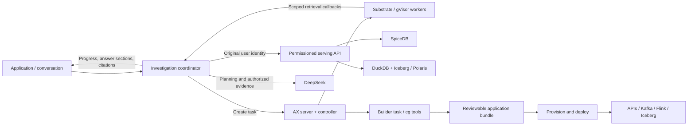

# AX execution in Context Graph

AX is the execution layer for tasks that work with the context graph. Substrate provides the sandbox runtime; Context Graph provides permissioned data, ingestion, SQL processing, and application APIs. Applications delegate work to AX while continuing to use the platform's identity and access rules.

The workplace assistant demonstrates this pattern. Every question in the normal conversation runs through AX, with progress, streamed answer sections, and clickable sources. AX is part of the implementation, so the user interacts with a single assistant.

The application harness provides a second entry point: an AX task can run the same bundle-authoring and compilation tools that developers and CI use. These two integrations connect task execution to both using the context graph and building applications on it.

## Components and responsibilities

| Component | Responsibility |
| --- | --- |
| Search UI | Conversation, follow-ups, streamed progress, and source presentation |
| Investigation coordinator | Authenticates the caller, plans retrieval, delegates an AX task, checks evidence, and streams the answer |
| AX server and controller | Manage task definitions and execution through Substrate |
| Substrate worker pool | Runs the investigator image in gVisor sandboxes |
| Permissioned serving API | Queries Iceberg through DuckDB and enforces SpiceDB access for the original caller |
| DeepSeek | Plans additional keyword searches and generates the answer from authorized evidence |
| Application harness | Compiles application bundles into ingestion, Kafka, Flink, Iceberg, and GraphQL definitions |



DeepSeek calls run in the coordinator for this assistant integration. The sandbox executes the retrieval plan through delegated callbacks. Provider credentials stay with the coordinator. The integration connects directly to DeepSeek.

## How a conversation runs

1. The UI submits the question and previous user questions to `POST /search/api/ask`. The frontend proxy routes it to the investigation coordinator's `/api/ask` endpoint.
2. The coordinator authenticates the caller against the serving API and acquires execution capacity. Waiting requests receive a progress event.
3. The coordinator plans lexical searches, creates a run capability, and submits an AX task with the investigator image and callback configuration.
4. The Substrate worker executes the task. Each callback selects a search from that run's plan. The coordinator performs retrieval using the original caller's identity.
5. The worker reports completion. The coordinator checks source permissions and revisions, then asks DeepSeek to synthesize the authorized evidence.
6. Each complete answer section is checked and streamed with its citations. The coordinator revokes the capability and requests task cleanup when the run ends.

Follow-up questions carry the previous user questions into planning and synthesis. Evidence is retrieved again under the caller's current permissions. Direct document search remains available through `/api/search`, backed by the same permissioned retrieval API.

The stream uses `status`, `search`, `block`, `reset`, `done`, and `error` events. Progress messages describe execution stages, such as “Searching your knowledge” and “Gathering supporting sources.” The UI renders answer sections as they arrive and opens verified source records from inline citations.

## Permissions and delegated access

The coordinator retains the authenticated user token. The investigator receives a short-lived capability scoped to its run and search plan. Its callbacks return document identifiers, dates, and ranking metadata; source text stays with the coordinator for answer generation.

Retrieval passes through the existing serving API and SpiceDB checks. The coordinator rechecks every model input before releasing answer sections, including its revision and source URL. Citation identifiers resolve to authorized source records. An access change invalidates the response, and the UI clears the affected answer.

The internal callback routes are `/internal/investigation/search` and `/internal/investigation/complete`. They require the run capability and are accessed over verified TLS. The public frontend exposes the conversation routes. AX and Substrate control endpoints remain private infrastructure services.

## Building applications with AX

The [builder task manifest](../services/harness/builder/ax.yaml) mounts an AX workspace and runs `cg init` and `cg build`. Its image packages the compiler, Flink and query tooling, and example bundle. Build artifacts contain authored sources, validated schemas, SQL definitions, and generated API definitions that can be inspected before release.

A developer, CI pipeline, or AX task can produce the bundle. The deployment workflow then provisions scoped Kafka and Polaris identities and deploys the application's services and jobs. See the [application harness guide](../services/harness/README.md) for commands and bundle structure.

Tasks that need application data can use [`ContextClient`](../services/harness/context_harness/client.py) with a delegated token file, workspace, and trusted CA. It exposes GraphQL queries, JSON ingestion, and a `trajectory(...)` helper. The example bundle supplies an ordinary `trajectories` ingestion endpoint, allowing applications to feed explicitly scoped run events back through Kafka and Flink into the context graph.

The shipped builder manifest demonstrates compilation. Domain applications can compose these pieces into their own workflows: deriving knowledge from group events, processing meeting media, or coordinating repository work.

## Source map and configuration

| Path | Purpose |
| --- | --- |
| [`services/search-api/investigation.py`](../services/search-api/investigation.py) | Capacity waiting, AX task submission, delegated callbacks, and cleanup |
| [`services/search-api/server.py`](../services/search-api/server.py) | Conversation endpoints, model calls, evidence checks, and SSE |
| [`services/investigator/`](../services/investigator/) | Sandbox retrieval worker and image |
| [`services/search-ui/`](../services/search-ui/) | Conversation UI and routing |
| [`deploy/ax/`](../deploy/ax/) | AX control-plane rendering, worker pool, and coordinator deployment |
| [`services/harness/builder/`](../services/harness/builder/) | Builder image, AX task manifest, and upstream revision pins |

The coordinator reads `AX_SERVER`, `AX_INVESTIGATOR_IMAGE`, and `POD_IP`. `AX_ATESPACE` selects its task namespace. `AX_CONCURRENCY` controls execution admission; the local deployment pairs two execution slots with two Substrate workers. Extra requests wait for capacity while the stream reports progress.

`AX_CALLBACK_HOST` and `AX_CALLBACK_PORT` configure the cross-cluster callback address. TLS verifies the `search-api` server identity using the configured CA. The local deployment runs one coordinator replica, which owns the run capabilities and streams.

## Build and operate

Run commands from the repository root. The pinned upstream revisions are recorded in [`upstream-lock.json`](../services/harness/builder/upstream-lock.json).

```sh
scripts/build-ax-tools.sh

docker build -f services/investigator/Dockerfile -t YOUR_REGISTRY/context-investigator:ax-v1 .
docker build -f services/search-api/Dockerfile.ax -t context-graph/investigation-api:ax-only-v2 .
```

The coordinator Dockerfile extends the existing search API base image. Publish the investigator image to a registry reachable by Substrate workers and set its image reference in the coordinator deployment. `AX_TARGET_ARCH` selects the architecture when building the AX binaries. The build script applies the repository's controller patch for sandbox resource settings, task-specific templates, and credential-bearing cold starts.

The local installation keeps the context graph on `docker-desktop` and AX/Substrate on the separate Kind cluster `context-ax`. Its kubeconfig is `.runtime/ax-kubeconfig`. Substrate uses Kubernetes certificate features enabled on that cluster: `ClusterTrustBundle`, `ClusterTrustBundleProjection`, and `PodCertificateRequest`.

After both clusters are running, start the development bridges:

```sh
scripts/ax-local-bridges.sh
```

Restart the bridges after a coordinator or AX server pod is replaced: Kubernetes port-forward attaches to a specific pod. Active streams and capabilities belong to the coordinator process; a replacement starts fresh sessions.

Inspect the worker pool and task status:

```sh
kubectl --kubeconfig .runtime/ax-kubeconfig --context kind-context-ax \
  -n context-search get workerpool,pods

# AX_CONTROL_ADDRESS is the private control endpoint exposed by your bridge.
.runtime/ax --server "$AX_CONTROL_ADDRESS" --atespace context-search get tasks

kubectl --context docker-desktop -n context-graph \
  rollout status deployment/investigation-api
```

The existing search metrics include conversation request status, duration, model-call status, and failure codes. The AX task status and worker pool show execution activity separately from application serving.

## Validation

The normal `/api/ask` route has been exercised through the deployed search frontend: it created a real AX/Substrate task and streamed answer sections with verified source references. An identity outside the knowledge workspace received HTTP 403 before task creation.

Concurrency verification submitted three simultaneous requests to the two-worker pool. Two ran immediately; the third reported waiting and completed after capacity became available. Tests also exercise capability validation, replay protection, permission changes, citation checks, stream ordering, route delegation, and capacity release on failure.
