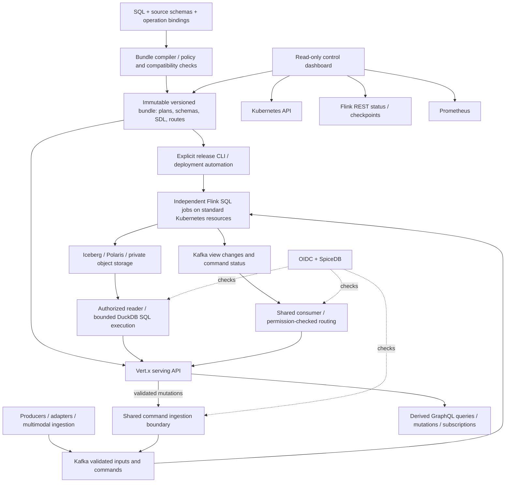

# SQL-backed context platform and derived application API

Status: architecture decision and implementation specification, September 2026. This document defines the replacement for the current fixed `aggregations` configuration, handwritten GraphQL operation signatures, and Flink Kubernetes operator deployment. **The running implementation has not yet been migrated.** Examples below describe the target contract, not configuration accepted by today's runtime.

The user-selected mutation model is **Kafka commands/events with processing status**. Application writes will not become direct transactional writes to DuckDB, Iceberg, or PostgreSQL.

## Decisions

1. SQL defines transformations and materialized views. Temporal aggregation is expressed in Flink SQL, alongside joins, projections, deduplication, and other supported relational operations. There is no separate aggregation API or DSL.
2. A versioned operation catalog defines parameterized serving SQL, typed command inputs, and change-stream bindings. GraphQL output types derive from the SQL result schemas; mutation inputs derive from command JSON Schemas; subscription types derive from their referenced view/change schemas. Authors do not maintain duplicate SDL.
3. YAML/JSON describes deployment bindings, parameter sources, policies, lifecycle, and limits. It does not reproduce SQL operators or attempt to infer business permissions from SQL.
4. Multiple independently versioned Flink SQL jobs run on ordinary Kubernetes resources. No FlinkDeployment CRD, Flink operator, or replacement Kubernetes custom operator.
5. SpiceDB remains mandatory through commands, transformations, queries, subscriptions, and derived results. Query optimizations must preserve authorization before joins and aggregates.
6. Polaris, private object storage, Iceberg, DuckDB `iceberg`, and `cache_httpfs` remain. Users receive authorized API results, not credentials for mixed-permission warehouse files.

## Execution and optimization requirements

These requirements define the target execution contract; they are not claims that every optimization is already implemented.

| Concern | Required behavior |
|---|---|
| SQL execution | Named SQL, bound values, explicit result cardinality, centralized timeouts and cancellation; output types derived from the prepared SQL schema |
| Parameter origins | Explicit argument, parent, identity, and cursor bindings; identity comes only from verified context; values are never interpolated into SQL |
| Pagination | Page-size caps, one-extra-row fetching, and signed cursors bound to operation/version, workspace, subject, filters, ordering, snapshot, and expiry; a unique ordering tie-breaker |
| Deployment identity | Immutable application bundles with deterministic configuration and content hashes; build once per version without Kubernetes CRDs |
| Flink submission | Submit a job's INSERTs together as one StatementSet; track the actual run lifecycle and redact sensitive plan metadata |
| Event mutations | Server-stamped scope, schema validation, command identity, retry semantics, and view-specific completion status |
| Subscriptions | Shared consumers, explicit changelog semantics, bounded fan-out, current authorization, and reconnect/resume rules |

GraphQL schema derivation must use validated SQL result schemas and command contracts. Pagination state must be operation/field-local so aliases and concurrent sibling resolvers cannot overwrite each other. Selection-set pushdown and DataLoader batching are proposed optimizations that must preserve the authorization boundary before adoption.

## Architecture



The bundle compiler is a build/deployment component. The read-only control dashboard stays read-only. Flink's scheduler handles task execution/recovery; Kubernetes manages ordinary workloads. Explicit release automation handles upgrades and savepoints without a custom resource reconciliation loop.

## SQL authoring and compilation

Keep engine dialects explicit: **Flink SQL for continuous processing; DuckDB SQL for serving.** One operation catalog ties their schemas together; it does not claim the engines have identical SQL syntax or execution semantics.

A bundle contains source/sink schemas, SQL files, operation bindings, authorization policy references, connector/secret references, runtime limits, and version hashes. Compilation must:

1. Register source schemas and bind connector definitions through trusted adapters. Keep credentials out of SQL source, generated SDL, diagnostics, and plan artifacts.
2. Parse/plan SQL with its engine. Derive result names and types from planner metadata, not SQL text regular expressions or sampled rows.
3. Resolve named parameter types and origins. Explicit declarations are required for ambiguous parameters; values are always bound.
4. Validate output key, changelog mode, schema compatibility, and authorization lineage. Reject unsupported contracts before deployment.
5. Generate operation schemas, GraphQL SDL/resolver bindings, job plans, and a content-addressed manifest.
6. Produce a compatibility report for current clients and stateful jobs. An invalid candidate does not replace the active schema.

DuckDB can describe a query's output schema, but query-derived nullability is limited. Generate nullable fields conservatively unless a stronger contract is validated. Preserve decimal and 64-bit integer precision with deliberate scalars; do not silently map every number to GraphQL Float or Int. Complex unions and unconstrained JSON remain JSON unless an explicit schema gives a safe typed representation. See [DuckDB DESCRIBE](https://duckdb.org/docs/stable/sql/statements/describe.html).

An operation binding can look like this:

```yaml
version: 1
queries:
  assetMetrics:
    sql: sql/serve/asset-metrics.sql
    sources:
      metric_windows: views.asset_metric_windows
    parameters:
      assetId: {type: string, required: true, from: argument}
      first: {type: int32, default: 50, maximum: 200, from: argument}
    result: many
    authorization: authorized-inputs
```

```sql
-- DuckDB serving SQL; source rows have already been authorized.
SELECT entity_id, metric, window_start, window_end,
       sample_count, avg_value, max_value
FROM metric_windows
WHERE entity_id = :assetId
ORDER BY window_end DESC, metric ASC
LIMIT :first;
```

The compiler derives the result object. GraphQL arguments come from parameter contracts; hidden workspace/identity parameters come from verified context and never appear as caller-selectable identity overrides. Stable operation names are explicit. Nested relationships need explicit keys and cardinality; matching column names is not enough to infer them safely.

Pagination is a separate operation contract. The simple example above is a bounded list, not a complete cursor implementation. Cursor-enabled SQL must use a declared total order, a tie-breaker unique within the scope, and predicate bindings for its keyset. Historical pagination binds the relevant Iceberg snapshot vector. Every page rechecks current permissions even when its data snapshot is pinned.

## Flink SQL replaces the fixed aggregation configuration

Validated input adapters expose logical, typed relations while retaining the original payload and trusted resource labels. Schema validation and operational error handling remain outside the user's SQL, at trusted source/sink boundaries.

For example, a logical `observations` table exposes `workspace_id`, `resource_id`, `entity_id`, `metric`, `value`, and a watermarked event-time `event_time` column. A temporal view is ordinary SQL:

```sql
CREATE TEMPORARY VIEW asset_metric_windows AS
SELECT workspace_id, resource_id, entity_id, metric,
       window_start, window_end,
       COUNT(*) AS sample_count,
       SUM(value) AS sum_value,
       AVG(value) AS avg_value,
       MIN(value) AS min_value,
       MAX(value) AS max_value
FROM TABLE(TUMBLE(TABLE observations, DESCRIPTOR(event_time), INTERVAL '10' SECOND))
GROUP BY workspace_id, resource_id, entity_id, metric, window_start, window_end;

INSERT INTO warehouse_metric_windows SELECT * FROM asset_metric_windows;
INSERT INTO live_metric_windows SELECT * FROM asset_metric_windows;
```

These relation names assume registered source/sink definitions. Each job groups its INSERTs into one `StatementSet`, allowing the planner to optimize them together and submit them as one job. Independent job definitions are submitted independently, with their own lifecycle. Multiple sinks still do not imply an atomic transaction across Kafka and Iceberg. See [Flink StatementSet](https://nightlies.apache.org/flink/flink-docs-release-2.3/api/java/org/apache/flink/table/api/StatementSet.html).

The author can use other supported SQL operators without adding a new platform API for each one. The compiler must check whether the resulting stream is append-only or produces updates/deletes. Updating views need keys and sinks that implement the appropriate changelog/upsert behavior; a generic GROUP BY cannot simply be attached to today's append-only Iceberg output.

Typed schemas remain necessary around flexible JSON. Retain arbitrary payload fields, use SQL JSON expressions to project domain columns, and version those projections. SQL-derived output JSON Schemas must validate every published Kafka result, including updates and tombstones.

## Authorization is part of the relational contract

The current API's authorized-input materialization is the correctness baseline. All proposed optimization work must be compared against it.

- Writes authenticate the caller, require workspace/write access, and derive the canonical resource label on the server. Every affected entity of a multi-resource command requires its declared permission. An imported entity's source rules cannot be bypassed by local workspace administration.
- Read inputs are restricted to authorized resources before joins, aggregates, top-N, or user-visible errors/results. Both ends of graph edges require authorization.
- SQL transformations preserve policy lineage. A correctly formatted `resource_id` does not prove that an aggregate contains only that resource's data.
- Initially admit materialized, resource-local views whose scope preservation can be established from the relational plan. Grouping keys include the resource/workspace boundary, and joins must preserve validated input scopes. Reject plans with unprovable lineage, relabeled mixed-resource aggregates, or undeclared cross-resource derivation.
- Cross-resource joins/aggregations can run over caller-authorized inputs at serving time. Durable cross-resource outputs require an explicit contributor/provenance policy and checks for all contributors; labeling them with one convenient resource is insufficient.
- Arbitrary UDFs, external reads, secret access, and policy-changing operations are privileged extensions. They are not enabled through end-user SQL.
- No positive authorization cache is shared across requests. Immutable schema/plan caching and private object-block caching are separate from permission decisions.

An AST/relational-plan policy checker is required for the expanded SQL surface. The existing restricted `SafeSql` checks must not be stretched into a supposed general SQL security parser.

## Derived mutations and honest completion status

A mutation publishes a validated command through the same trusted ingestion path as REST. It does not issue writable SQL against Iceberg or publish arbitrary client-selected Kafka topics.

```yaml
commands:
  recordObservation:
    inputSchema: schemas/record-observation.json
    resource: input.entityId
    permission: write
    destination: streams.observation_commands
    idempotency: required
    completionViews: [views.observations]
```

The compiler generates a typed `RecordObservationInput` from the JSON Schema and a mutation such as `recordObservation(input: RecordObservationInput!, idempotencyKey: String!): CommandReceipt!`. It must reject or explicitly represent JSON Schema constructs that GraphQL cannot express; JSON Schema remains the authoritative runtime validator.

The receipt contains `commandId`, `status`, and `acceptedAt`. The server stamps the caller/workspace, command schema version, operation version, canonical resource identity, and payload hash. Credentials and security labels are not input fields. An idempotency key is scoped to caller, workspace, and operation; retrying the same key with a different payload is a conflict.

Define observable states precisely:

| State | Meaning |
|---|---|
| `ACCEPTED` | Kafka has acknowledged the command; derived results may not exist yet |
| `PROCESSING` | Optional progress state from the responsible processor, not a claim of completion |
| `APPLIED` | A named target view has confirmed a committed, query-visible revision/snapshot for the command |
| `FAILED` | A terminal processing/domain error recorded with a safe public error code |

Completion is per declared view/version, not “all jobs everywhere finished.” A mutation with several completion views reports their individual outcomes; it cannot manufacture a globally atomic commit. A status query/subscription checks both command ownership/visibility and current access to its affected resources.

Checkpoint-aware completion tracking is essential. Emit `APPLIED` only after verifying the relevant sink commit and visibility; an event emitted inside a processing operator is not sufficient evidence. Record pending outcomes durably and reconcile after recovery. Kafka status publication and Iceberg commit can race; reconciliation must tolerate either arrival order.

Durable deduplication must survive retries, restarts, and publisher crashes. A deterministic ID alone is not exactly-once processing. Define the deduplication retention horizon, replay behavior after expiry, concurrent retries, and status reconstruction. A durable acceptance ledger/outbox may use a separately scoped service database; this is infrastructure bookkeeping, not transactional application mutations. Until that mechanism and processor deduplication are implemented, do not promise unique command application.

## Derived subscriptions

Each subscription references a compiled view or command-status contract. Its row type comes from that contract, with explicit `key`, `revision`, `changeKind`, and optional resume metadata. Keys and authorization labels must be present even when GraphQL does not select them.

Support two distinct delivery modes:

- **View changes:** consume a Flink-produced changelog with explicit insert/update/delete semantics, project selected fields, and check permissions before every emission. No query per event is needed for this mode.
- **Live query:** authorized initial SQL result plus subsequent invalidation/re-execution. Coalesce relevant changes with bounded delay; re-run SQL against committed view state, not merely when an earlier Kafka record arrives.

A shared consumer per serving replica/topic set handles broker reads; local dispatch indexes workspace, resource/key, and operation dependencies before routing into bounded Reactor Flux streams. Per-client filters and authorization remain separate. No Kafka consumer per browser. Unrelated topic changes should not re-run every live query.

Use `graphql-transport-ws` with bounded operations, token expiry, cancellation, slow-consumer errors, and explicit reconnect handling. A resume token must bind caller/workspace, operation version, arguments, and partition offsets; validate retention and permissions on resume. Do not accept arbitrary user-supplied offsets as a bypass.

A gap-free initial snapshot plus changes requires a durable handoff between Iceberg snapshot visibility and stream offsets. Buffering alone is insufficient without a committed boundary. Until that protocol is implemented, expose explicit snapshot/live phases and require a fresh snapshot on reconnect; do not market best-effort notifications as a lossless replay stream. Revocation must also invalidate previously presented live-query state without revealing new restricted data.

## Optimization plan

| Optimization | Benefit | Required correctness boundary |
|---|---|---|
| Compile bundles once; cache prepared schema/plan metadata by content hash | Avoid repeated SDL construction and planning | Include SQL, source schema IDs, policy version, engine version, and parameter contract in the key; do not cache caller data with the plan |
| Projection pruning | Read/serialize only necessary columns | Retain authorization, relationship, cursor, and evidence columns even when unselected; avoid changing DISTINCT/grouping semantics |
| Safe predicate/partition pruning | Reduce object reads and candidate resources | Push predicates only when equivalent under authorization; keep joins/aggregates over authorized inputs and prevent unauthorized expression errors |
| Request-local source reuse | Avoid rescanning/materializing the same authorized source for sibling fields | Scope to caller, workspace, snapshot, policy, and operation context; recheck access before output |
| Request-local DataLoader batching | Avoid N+1 relationship lookups | Batch only an explicit relationship binding with the same authorization context; preserve key-to-result correspondence |
| Signed keyset cursors | Bound pagination cost and prevent parameter tampering | Stable ordering, scope/filter/version/snapshot binding, expiry, size caps, and current permissions |
| Bounded worker-local DuckDB connections | Reduce repeated connection/extension setup | Load pinned extensions at startup; isolate credential-bearing readers from credential-free execution; fully reset/discard any reused context |
| Columnar transfer / DuckDB appender where appropriate | Reduce per-row map creation and JDBC insertion overhead | Profile and validate types, nulls, memory ceilings, and permission provenance before adoption |
| Shared subscription consumers and indexed routing | Scale connections independently from Kafka consumers | Independent bounded client queues and per-emission checks; no cross-user result sharing by default |
| Change-driven live queries | Reduce redundant polling and SQL work | View commit visibility, event coalescing, cancellation, and correct revision comparison |
| StatementSet within each Flink job | Submit related sinks together and permit common-plan optimization | Independent sink commits and explicit job failure boundaries |

`cache_httpfs` stays in the private read path. Its cache does not authorize users. Raw files, cached blocks, catalog credentials, and readers stay inaccessible to configurable SQL and browser clients. Query-result caches shared across users remain disabled unless a future design proves equivalent visibility and revocation behavior.

Measure scan bytes, authorized materialization bytes, plan/execute time, permission-check count/latency, result rows, queue wait, connection reuse, live fan-out, and per-view freshness. Compare p50/p95 latency and memory on the same dataset and permission distribution before claiming an optimization.

## Multiple Flink jobs without an operator

Use **standalone application clusters on standard Kubernetes Deployments and Services**, initially one isolated cluster per independently versioned SQL job. A job may contain a StatementSet for several related outputs. A later explicitly configured session-cluster profile can reduce local resource overhead for small jobs, accepting a shared failure/resource boundary; it is not the default isolation model.

Flink documents standalone Kubernetes deployment without an operator. Kubernetes HA services can still coordinate JobManager leadership; that is separate from using a Kubernetes operator. See [Flink 2.3 standalone Kubernetes](https://nightlies.apache.org/flink/flink-docs-release-2.3/docs/deployment/resource-providers/standalone/kubernetes/).

Each job bundle carries:

- Immutable SQL/plan/image identity; unique cluster ID, consumer group, transactional ID prefix, and explicit output bindings.
- Ordinary JobManager/TaskManager workload definitions, internal Services, probes, resource budgets, RBAC, network policies, and Prometheus annotations.
- Incremental RocksDB checkpoints and retained savepoints in a per-job object-storage prefix; bounded checkpoint concurrency and minimum pause.
- Stable state/operator identities where supported, a recorded restore source, and an explicit policy for incompatible state changes.

Release automation performs plan validation, savepoint/stop or isolated candidate start, health/checkpoint/lag verification, route/view cutover, and rollback bookkeeping through standard Kubernetes and Flink REST APIs. It records asynchronous operation IDs and handles retries without duplicate job submission. REST endpoints remain private, and lifecycle credentials are separate from the read-only dashboard.

For a changed SQL topology, state compatibility must be checked; a savepoint alone does not guarantee restorable state. Build a new view from replay/backfill when the old state cannot be safely restored. Do not set `allowNonRestoredState` automatically to hide incompatibility.

Candidate jobs write isolated destinations. Two versions must not both write the same production table or transactional prefix during a blue/green rollout. An incompatible serving schema uses a versioned endpoint/bundle; existing WebSocket operations stay pinned to their compatible contract until reconnect.

The control plane reads ordinary Kubernetes workload status, the bundle inventory, Flink REST job/checkpoint status, and Prometheus. It can show SQL, input/output schemas, dependencies, job versions, lag, checkpoint age, pending commands, and serving-view freshness without receiving mutation privileges.

## Migration and acceptance gates

| Workstream | Existing touchpoints | Completion evidence |
|---|---|---|
| Operation compiler | `services/query/QueryService`, `IcebergQueries`, `SafeSql`, `config/queries.yaml` | Result types match prepared SQL metadata; generated mutations/subscriptions validate; invalid candidates preserve active schema |
| Parameter/cursor execution | `IcebergQueries.bind`, resolver wiring | Quoted strings/comments/casts handled correctly; concurrent aliases isolated; cursor tampering, scope reuse, and expiry rejected |
| SQL processing | `services/processor/JobConfig`, `ContextGraphJob`, `Transforms`, `IcebergTables`, `config/jobs*.yaml` | SQL window/join/filter cases; at least two jobs; both StatementSet sinks active; invalid schema and unsafe lineage rejected |
| Mutation ingestion/status | Shared security/ingestion boundary plus new command contracts | Denied write produces no command; same-key retry and conflicting payload behavior; crash/restart dedup; APPLIED waits for visible commit |
| Live routing | `LiveBus`, `EventAuthorization`, WebSocket handlers | Disjoint-user isolation; revocation; slow clients; cancellation; expiry; reconnect with explicit gap semantics |
| Deployment | `deploy/k8s/flink.yaml`, `scripts/deploy.sh`, renderer, wait/version/upgrade scripts, policies and RBAC | Fresh deployment needs no Flink CRDs; multi-job restart/savepoint/restore; rollback; metrics and control visibility |
| Compatibility | Existing demo/search clients and permissions tests | Original operations retained as generated aliases/views where compatible; source and media access still enforced |

Migrate to isolated candidate topics/tables first. Validate restore/replay and serving compatibility, then cut over. Retire the existing FlinkDeployment only after ownership/finalizer behavior, checkpoint retention, and output handoff are accounted for. Removing an operator chart before migrating its managed job can strand lifecycle management; deleting its resources prematurely can remove the running job.

Completion means the fixed `aggregations` authoring surface, handwritten core operation SDL, and runtime operator dependency have actually been removed; the new contracts work in deployed tests. This design document does not claim that migration is complete.
