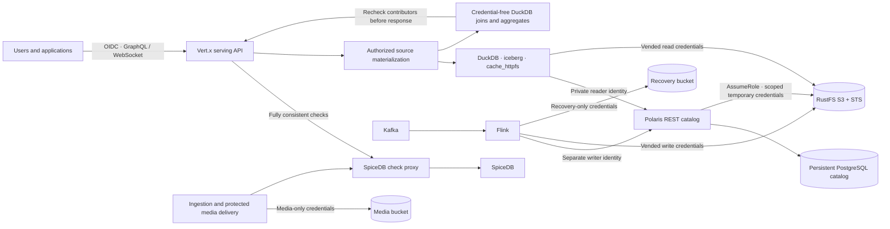

# Governed lakehouse and federated serving

Users and applications connect to the serving API with an OIDC token and workspace ID. They do **not** receive Polaris tokens, object credentials, presigned object URLs, or raw metadata locations. The serving API remains the enforcement point for SpiceDB's workspace membership and restricted-entity permissions.



## Permission boundary

The existing tables mix entities in the same Parquet files. An Iceberg catalog permission or a scoped S3 credential cannot remove forbidden rows from those files. Consequently, direct user access to Polaris or S3 would bypass entity-level authorization. Network policies keep both services private; Polaris authenticates separate query, processor, and migration principals. Only an operator has the bootstrap credentials.

Polaris enforces service-level catalog privileges and vends table-scoped STS credentials. SpiceDB enforces user-level permissions in the serving API. These are separate responsibilities: Polaris is not presented as a native SpiceDB row-policy engine.

For every named query, the API checks workspace membership, verifies the provenance of candidate resource IDs, checks entity visibility (both endpoints for edges), and materializes only permitted rows. Federated queries materialize every input independently before entering a fresh DuckDB database that has no catalog handles or credentials. The final SQL runs with external access disabled and configuration locked. Membership and contributor permissions are rechecked before returning a result. Authorization outages fail closed. Raw object caches are private implementation details; a cache hit does not bypass these checks.

Temporary credential expiry limits service credential exposure. Human revocation does not depend on STS expiry because humans never receive these credentials. No system can revoke data a client has already received.

## Query configuration

`config/queries.yaml` registers each table and its entity columns. Existing single-table queries remain supported. `sources` enables joins across registered tables:

```yaml
entityMetrics:
  signature: 'entityMetrics(metric: String!, limit: Int = 100): [EntityMetric!]!'
  sources:
    graph_nodes: context_secure.nodes
    metric_windows: context_secure.metrics
  sql: |
    WITH latest_nodes AS (
      SELECT node_id,node_type,
             row_number() OVER (PARTITION BY node_id ORDER BY event_time DESC) rn
      FROM graph_nodes
    )
    SELECT m.entity_id,n.node_type,m.metric,
           sum(m.sample_count) sample_count,sum(m.sum_value) sum_value
    FROM metric_windows m JOIN latest_nodes n ON m.entity_id=n.node_id AND n.rn=1
    WHERE m.metric=:metric
    GROUP BY m.entity_id,n.node_type,m.metric
    ORDER BY m.entity_id LIMIT :limit
```

Call the generated `entityMetrics` GraphQL field with normal user authentication. SQL and source registrations are operator-controlled YAML, not arbitrary SQL submitted by an end user. One query can use up to eight registered sources; combined row/resource bounds prevent silently truncated aggregates. Current federation covers registered Iceberg tables in the configured Polaris namespace. Snapshots are selected per source, so cross-table results are eventually consistent rather than a globally atomic snapshot. Kafka continues to provide live subscriptions; it is not falsely represented as an unbounded SQL snapshot.

## Storage and identities

| Component | Identity and scope |
|---|---|
| Serving API | Polaris reader; vended warehouse reads; no static S3 key |
| Flink Iceberg sinks | Polaris writer; vended warehouse writes |
| Flink recovery | Separate RustFS identity restricted to `context-recovery` |
| Ingestion | Separate RustFS identity restricted to `context-media` |
| Polaris | Warehouse-only storage identity with STS AssumeRole permission |
| Migration | Separate temporary operational principal; not mounted in serving workloads |

Polaris 1.7.0 runs with two replicas, shared signing keys and a dedicated PostgreSQL database/owner. It uses the existing PostgreSQL server, which remains a single point of failure. RustFS 1.0.0-beta.8 is pinned to the version in Polaris's integration guide; this is a beta dependency, not a claim of production certification. RustFS uses a persistent local Kubernetes volume and TLS. The deployment has no MinIO server or client dependency; administrative provisioning uses RustFS `rc` 0.1.36.

Warehouse objects live in `s3://context-warehouse`; media objects in `s3://context-media`; new checkpoints, savepoints and HA files in `s3://context-recovery`. FFmpeg uses local staging and uploads complete chunks before publishing their playlist entries or Kafka events. Media is served by the API with current SpiceDB checks, including ranges and continued checks while streaming. Local staging is not an authorization boundary.

## Migration and availability

Suspend the existing Flink writer with savepoint upgrade mode, wait for its completed savepoint, and run `deploy/k8s/migrate-warehouse.yaml`. `MigrateWarehouse` rewrites each table's **current live rows**, verifies row counts and an order-independent SHA-256 fingerprint by reading the destination, and carries the source Flink commit markers into the migration snapshot. It does not claim to migrate historical snapshot IDs: the old warehouse, including its complete snapshot history, is retained for rollback/audit. A source snapshot change aborts a retry.

Existing media is copied without changing public URLs; `scripts/migrate-media.py` verifies each uploaded object's SHA-256 by downloading it. Flink has now been restored from an S3 savepoint and completed a new S3 checkpoint with every legacy data-volume mount removed. The old local warehouse/recovery volume is retained offline for rollback and audit; running services do not mount it.

The first storage migration pauses Flink output while Kafka buffers accepted events. Serving APIs and the Polaris replicas support rolling deployment. A single local RustFS instance and a single PostgreSQL server cannot provide zero downtime during storage/database replacement or node failure. Distributed storage and database HA are required to remove those limits.

## Sources

- [DuckDB Iceberg catalogs and Polaris credential vending](https://duckdb.org/docs/current/core_extensions/iceberg/catalogs)
- [Polaris S3/STS configuration](https://polaris.apache.org/releases/1.7.0/configuration/configuring-polaris-for-production/configuring-aws-s3-cloud-storage-specific/)
- [Polaris RustFS integration](https://polaris.apache.org/guides/rustfs/)
- [RustFS TLS configuration](https://docs.rustfs.com/en/integration/tls-configured)
- [RustFS administration client](https://github.com/rustfs/cli)

## Local commands

`scripts/build.sh` builds the pinned application images. `KUBE_CONTEXT=docker-desktop STORAGE_NODE=docker-desktop PYTHON=.runtime/security-venv/bin/python scripts/deploy.sh` prepares TLS and private lakehouse service identities before deploying clients (see its usage for arguments). `scripts/deploy-lakehouse.py --context docker-desktop` can reapply just the private storage/catalog infrastructure idempotently; it opens temporary loopback port-forwards and closes them afterward. It requires the existing PostgreSQL service and `.runtime/security` CA material. The Python dependencies are in `scripts/security-requirements.txt`.

The one-time existing-data migration is deliberately separate from deployment: suspend the old writer first, run the warehouse migration Job and media copy, verify the evidence, then resume with the REST catalog configuration. Automatic deployments never delete the retained local warehouse or rerun data imports.

Example application request (the token is issued by your OIDC provider):

```http
POST /graphql
Authorization: Bearer <token>
X-Workspace-Id: demo
Content-Type: application/json

{"query":"{ entityMetrics(metric: \"temperature\", limit: 100) { entity_id node_type sample_count sum_value } }"}
```

## Verified local result

The warehouse migration verified 3,771 events, 3,771 nodes, 21 edges and 51 metric windows by count and content fingerprint. Media migration verified 92 existing objects. The full secure pipeline smoke passed in 87.55 seconds, including cross-table aggregates, restricted-entity visibility, active subscription/upload revocation, token expiry and independently decodable HLS chunks. Vended reader credentials returned 403 for writes, unrelated prefixes and the media bucket; Polaris denied reader table creation. A native savepoint and subsequent checkpoints completed under `s3://context-recovery`. Evidence is in `docs/evidence/*lakehouse*`, `polaris-vending.json`, `warehouse-object-migration.log`, `object-checkpoint.json` and `object-savepoint.json`.

## Repeatable recovery and deployment checks

```sh
.runtime/security-venv/bin/python scripts/verify-polaris-vending.py --context docker-desktop
.runtime/security-venv/bin/python scripts/verify-object-recovery.py --context docker-desktop
```

The vending probe verifies that credentials are temporary and unexpired, table metadata can be read, credential refresh works, and writes, unrelated table prefixes, media/recovery buckets and anonymous catalog access are denied. It never prints credentials.

The recovery probe briefly suspends Flink at a completed S3 savepoint, resumes without the legacy PVC, verifies the exact restored savepoint through Flink REST, and waits for a new S3 checkpoint. Kafka buffers input during this pause. If verification fails, it restores the original deployment specification and requests the writer resume; it never deletes old data. The verified run completed in 52.25 seconds (`object-recovery.json`).

Bootstrap and the main renderer use the same explicit storage node. Reapplying the lakehouse deployment preserved pod UIDs and restart counts (`lakehouse-idempotence.json`). Temporary administration forwards select a ready, non-terminating service pod and are closed afterward. Bootstrap removes its temporary RustFS administration alias even on failure.

The follow-up infrastructure rollout exposed a recovery gap: a transient Polaris connection refusal during application startup left Flink in terminal `FAILED` state. The deployment now sets `kubernetes.operator.job.restart.failed: true`, allowing the operator to restart a failed application. The observed recovery restored savepoint 493 from S3 and completed subsequent S3 checkpoints; it did not restore the most recent pre-failure checkpoint. An administrator scan afterward found 3,879 event rows and 3,879 unique event IDs, with no duplicates in that scan (`failed-job-recovery.json`). This observation does not prove duplicate-free recovery for every failure timing or sink.

The full security smoke passed again after this recovery, including historical and federated queries, protected video, and live subscription revocation (`security-smoke-object-recovery.json`). All active Deployments and StatefulSets were ready afterward. Single-instance storage/database failover and a fresh empty-cluster installation remain unverified; the existing-cluster bootstrap reapplication was verified above.
